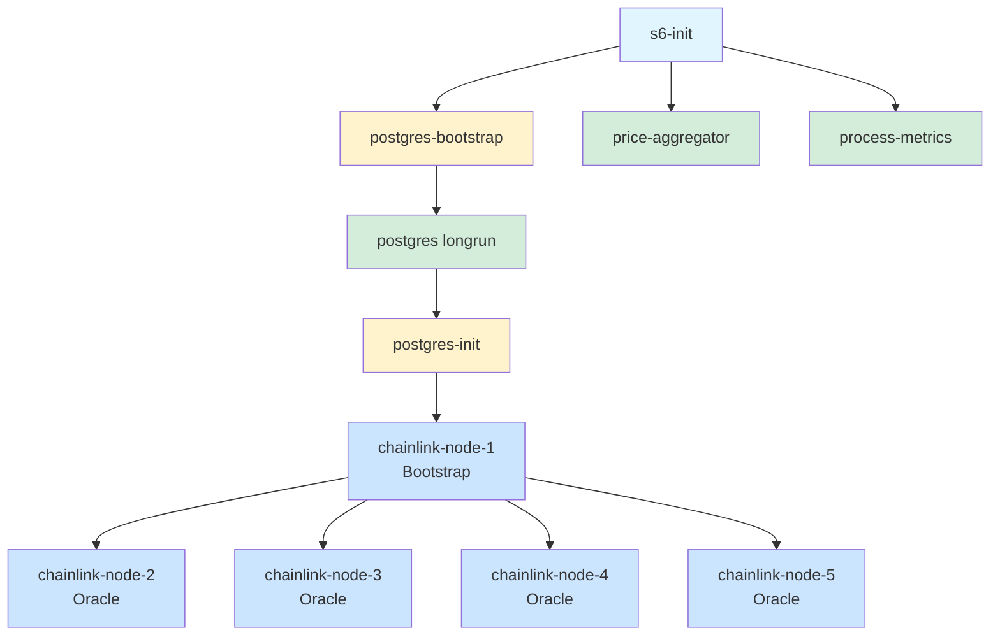
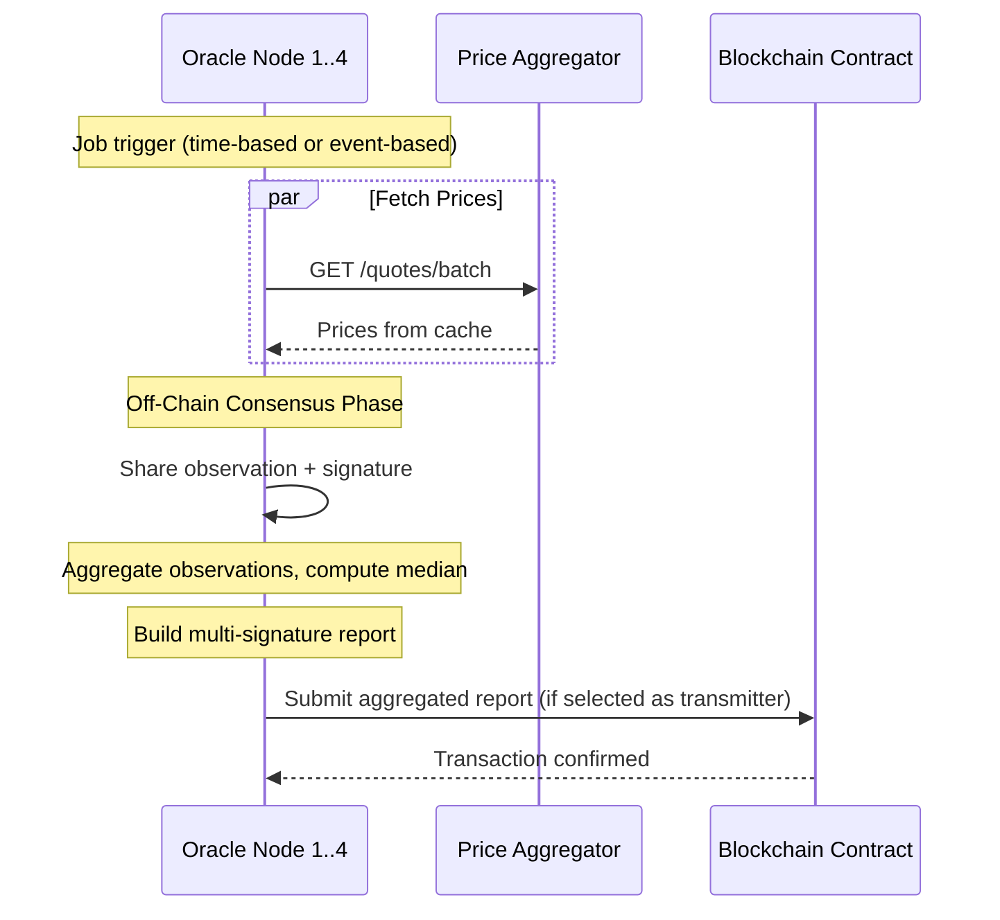
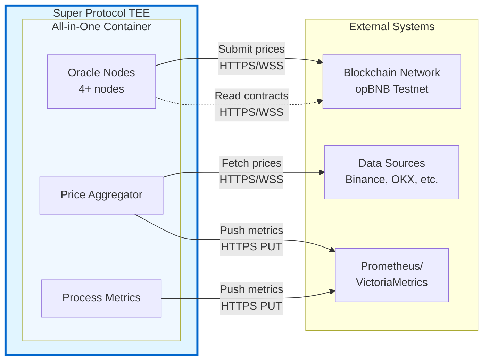
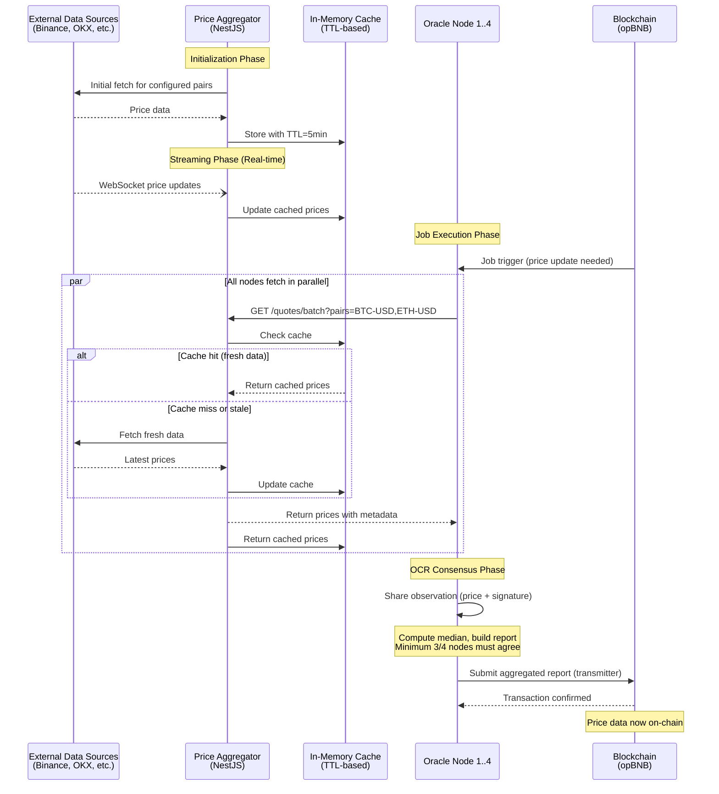
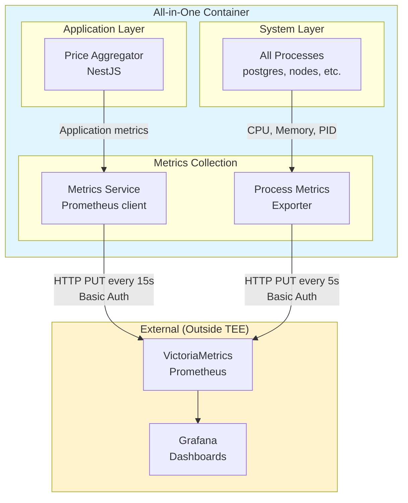
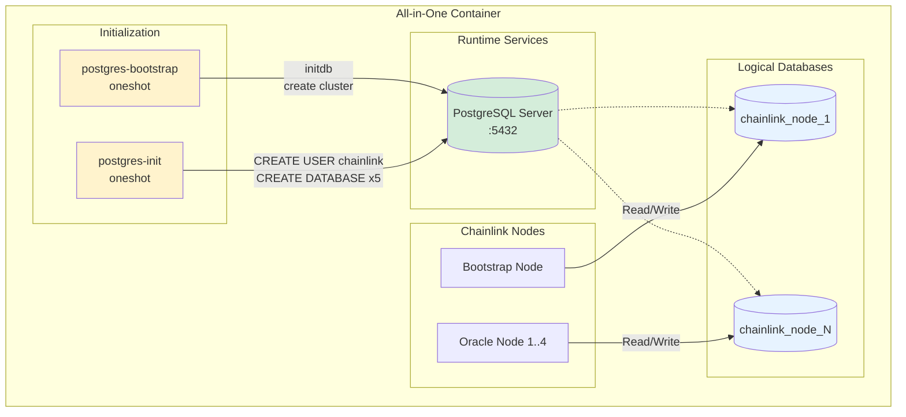
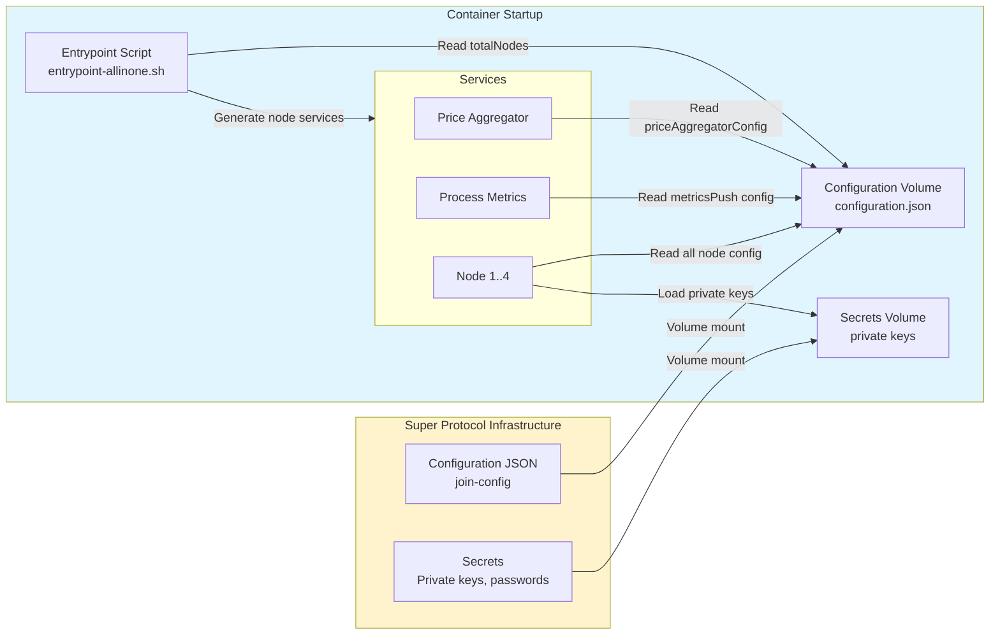
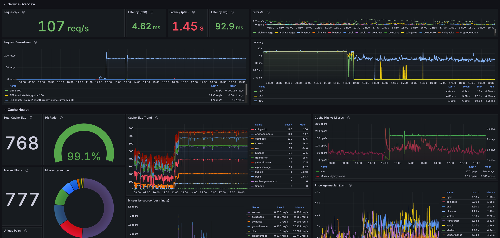

# Multi-node Chainlink Data Feeds in Super Protocol TEE - Architecture Documentation

## Table of Contents

1. [Overview](#1-overview)
2. [Container Architecture](#2-container-architecture)
3. [Solution Components](#3-solution-components)
4. [Network Architecture](#4-network-architecture)
5. [Data Flow Diagrams](#5-data-flow-diagrams)
6. [Monitoring & Observability](#6-monitoring--observability)

---

## 1. Overview

### 1.1 Purpose

This document describes the architecture of a Multi-node Chainlink Data Feeds solution running inside Super Protocol's Trusted Execution Environment (TEE). The solution implements a decentralized oracle network within a single All-in-One container to provide secure, tamper-resistant price data feeds to blockchain smart contracts.

### 1.2 High-Level Architecture

The solution consists of multiple Chainlink Oracle nodes (minimum 4 for consensus) working together to achieve decentralized price reporting through Off-Chain Reporting (OCR) mechanism, all running within an isolated TEE environment.

**Diagram**: [charts/01-system-context.mmd](charts/01-system-context.mmd)

Mermaid source (click to expand)

### 1.3 Key Characteristics

- **All-in-One Container**: Single container deployment containing all components
- **Multi-node Consensus**: Minimum 4 Oracle nodes for Data Feeds consensus via OCR
- **TEE Isolation**: Runs in trusted execution environment
- **Push-based Monitoring**: Metrics pushed to remote Prometheus (no pull access from TEE)
- **Centralized Price Aggregation**: Single Price Aggregator caching layer serving all nodes
- **Process Management**: s6-overlay supervises all services with dependencies and restarts
- **Database Isolation**: Shared PostgreSQL with separate databases per node

---

## 2. Container Architecture

### 2.1 All-in-One Container Structure

The All-in-One container packages all components into a single deployable unit optimized for TEE deployment. This approach simplifies management, reduces the attack surface, and ensures all components share the same trust boundary.

**Diagram**: [charts/02-container-architecture.mmd](charts/02-container-architecture.mmd)

Mermaid source (click to expand)

### 2.2 Process Management with s6-overlay

The container uses **s6-overlay v3.2.1.0** as its process supervisor. s6-overlay provides:

- **Service dependencies**: Ensures correct startup order
- **Automatic restarts**: Failed services are automatically restarted
- **Graceful shutdown**: Coordinated shutdown of all services
- **Logging**: Centralized log management with rotation

#### Service Dependency Graph

**Diagram**: [charts/03-service-dependency.mmd](charts/03-service-dependency.mmd)

**Legend:**
- Light Blue: Init process
- Yellow: Oneshot services (run once)
- Green: Longrun services (persistent)
- Blue: Chainlink nodes (longrun, dynamically generated)

### 2.3 Initialization Sequence

The container initialization follows this sequence:

1. **s6-overlay init** (`/init` entrypoint)
2. **Service generation** (`entrypoint-allinone.sh` at `/etc/cont-init.d/20-generate-services.sh`)
   - Reads `/sp/configurations/configuration.json`
   - Extracts `totalNodes` count
   - Generates service directories for each Chainlink node in `/etc/services.d/chainlink-node-{i}/`
   - Creates run scripts with unique ports and environment
3. **postgres-bootstrap** (oneshot)
   - Initializes PostgreSQL cluster with `initdb`
   - Applies ephemeral configuration optimized for TEE
   - Enables data checksums for corruption detection
4. **postgres** (longrun)
   - Starts PostgreSQL server as `postgres` user
   - Listens on port 5432
5. **postgres-init** (oneshot)
   - Waits for PostgreSQL to be ready
   - Creates `chainlink` user
   - Creates separate database for each node: `chainlink_node_1`, `chainlink_node_2`, etc.
6. **price-aggregator** (longrun)
   - Reads configuration from `/sp/configurations/configuration.json`
   - Starts NestJS application on configured port (default 3000)
   - Begins caching price data from external sources
7. **process-metrics** (longrun)
   - Starts metrics exporter on port 3003
   - Begins monitoring all s6-managed processes
8. **chainlink-node-1 to chainlink-node-N** (longrun)
   - Each node starts with unique:
     - API port: `BASE_API_PORT + node_number` (default 6601, 6602, etc.)
     - P2P port: `9900 + node_number` (9901, 9902, etc.)
     - Database: `chainlink_node_{node_number}`
     - Working directory: `/chainlink/node-{node_number}`
   - Node 1 acts as Bootstrap node
   - Nodes 2+ act as Oracle nodes connecting to Bootstrap

### 2.4 Service Definitions

All s6-rc service definitions are located in `/etc/s6-overlay/s6-rc.d/`:

| Service | Type | Dependencies | Description |
|---------|------|--------------|-------------|
| `postgres-bootstrap` | oneshot | none | Initializes PostgreSQL cluster |
| `postgres` | longrun | `postgres-bootstrap` | PostgreSQL database server |
| `postgres-init` | oneshot | `postgres` | Creates users and databases |
| `price-aggregator` | longrun | none | Price caching service |
| `process-metrics` | longrun | none | System metrics exporter |
| `chainlink-node-{i}` | longrun | `postgres-init` | Chainlink nodes (generated dynamically) |

### 2.5 Restart and Failure Handling

Each service has a `finish` script that handles crashes:

- **Max restarts**: 3 attempts by default (configurable via `MAX_RESTARTS`)
- **Restart counter**: Tracked in `/run/service/{service-name}/restart-count`
- **Container termination**: After max restarts exceeded, s6-svscan terminates, stopping the container
- **Service restart tracking**: Last restart timestamp recorded in `/run/service/{service-name}/last-restart`

This ensures fast recovery from transient failures while preventing infinite restart loops that could hide serious issues.

---

## 3. Solution Components

### 3.1 Chainlink Infrastructure

#### 3.1.1 Bootstrap Node

**Purpose**: The Bootstrap node serves as the coordination point for the Oracle network.

**Key Responsibilities**:
- Provides P2P discovery endpoint for Oracle nodes
- Maintains peer list and network topology
- Facilitates initial connection establishment
- Does NOT participate in OCR consensus or price reporting

**Configuration**:
- Always Node 1 in the deployment
- P2P port: 9901 (default)
- API port: 6601 (default)
- Database: `chainlink_node_1`
- Bootstrap address: `chainlink-node-1:9901`

**Network Role**: Oracle nodes connect to the Bootstrap node address specified in configuration (`bootstrapNodeAddresses` parameter).

#### 3.1.2 Oracle Nodes (Minimum 4 for Data Feeds)

**Purpose**: Oracle nodes participate in the Off-Chain Reporting (OCR) consensus mechanism to aggregate and submit price data to the blockchain.

**Why Minimum 4 Nodes?**
Chainlink Data Feeds using OCR require a minimum of 4 Oracle nodes to achieve consensus and fault tolerance:
- **Byzantine Fault Tolerance**: Can tolerate up to ⌊(n-1)/3⌋ faulty nodes
- **With 4 nodes**: Can tolerate 1 faulty node (⌊3/3⌋ = 1)
- **Consensus requirement**: 2f+1 nodes must agree (with 4 nodes: 3 must agree)
- **Security**: Prevents single point of failure and manipulation

**Key Responsibilities**:
- Fetch price data from Price Aggregator
- Participate in OCR protocol to reach consensus
- Sign aggregated reports
- Submit consensus reports to blockchain smart contracts
- Monitor job specifications from smart contracts

**Configuration per Node**:

| Node | Role | API Port | P2P Port | Database |
|------|------|----------|----------|----------|
| Node 1 | Bootstrap | 6601 | 9901 | chainlink_node_1 |
| Node 2 | Oracle | 6602 | 9902 | chainlink_node_2 |
| Node 3 | Oracle | 6603 | 9903 | chainlink_node_3 |
| Node 4 | Oracle | 6604 | 9904 | chainlink_node_4 |
| Node 5 | Oracle | 6605 | 9905 | chainlink_node_5 |

**Off-Chain Reporting (OCR) Process**:

**Diagram**: [charts/04-ocr-consensus-flow.mmd](charts/04-ocr-consensus-flow.mmd)

**Inter-node Communication**:
- Protocol: P2P networking via libp2p
- Discovery: Via Bootstrap node
- Consensus: Direct peer-to-peer messaging
- Data source: All nodes query the same Price Aggregator instance

**Job Configuration**:
- Jobs are configured via `join-config` and deployed through admin scripts
- Each job specifies: data source URL, update frequency, threshold parameters
- Price Aggregator URL is injected as environment variable

### 3.2 PostgreSQL

**Purpose**: Shared database engine providing persistent storage for all Chainlink nodes.

**Architecture Approach**: Single PostgreSQL instance with database isolation per node.

**Key Characteristics**:
- **Version**: PostgreSQL 17
- **Data Directory**: `/sp/postgresql/data`
- **Port**: 5432 (internal)
- **User**: `postgres` (superuser), `chainlink` (application user)
- **Max Connections**: 1000

**Database Isolation**:

| Database Name | Owner | Used By |
|---------------|-------|---------|
| `chainlink_node_1` | chainlink | Bootstrap Node (Node 1) |
| `chainlink_node_2` | chainlink | Oracle Node 2 |
| `chainlink_node_3` | chainlink | Oracle Node 3 |
| `chainlink_node_4` | chainlink | Oracle Node 4 |
| `chainlink_node_5` | chainlink | Oracle Node 5 |

**Why Shared PostgreSQL?**
- Reduces resource footprint in TEE environment
- Simplifies backup and management
- Database isolation still provides logical separation
- Each node cannot access other nodes' data

### 3.3 Price Aggregator

**Purpose**: Centralized caching layer that fetches and aggregates price data from multiple external sources, serving all Oracle nodes with consistent, fresh data.

**Architecture**: NestJS-based microservice with modular design.

#### 3.3.1 Caching Layer

**TTL Mechanism**:
- Each data source has configurable TTL (default: 5 minutes / 300,000ms)
- Cache entries expire based on source TTL
- Expired entries are removed and trigger refetch

**Data Freshness Guarantees**:
- **Pre-fetching strategy**: `staleTriggerBeforeExpiry` parameter (default 5 seconds)
- Cache entry marked as "stale" before actual expiration
- Refetch Service triggered to refresh before expiry
- Ensures Oracle nodes always get fresh data without cache misses

**Inactive Pairs Cleanup**:
- Pairs not requested for 10 minutes (configurable) are removed from cache
- Cleanup runs every 20 seconds
- Prevents memory bloat from unused trading pairs

#### 3.3.2 External Sources Integration

The Price Aggregator supports the following external data sources:

- Binance
- OKX
- CoinGecko
- Kraken
- Coinbase
- CryptoCompare
- Finnhub
- AlphaVantage
- ExchangeRateHost
- Frankfurter
- Yahoo Finance
- KuCoin
- Bybit

#### 3.3.3 Traffic Optimization

**Centralized Data Fetching**:
- Single Price Aggregator instance serves all Oracle nodes
- Avoids duplicate requests to external APIs
- Shared cache reduces external API load by ~80%

**Example**: Without Price Aggregator (4 Oracle nodes × 100 pairs × 10 requests/min) = 4,000 requests/min to external APIs. With Price Aggregator: ~1,000 requests/min (4× reduction).

**Batch Processing**:
- Oracle nodes request multiple pairs in single HTTP call
- Price Aggregator efficiently batches requests to sources
- Reduces network overhead and latency

### 3.4 Prometheus Metrics

**Purpose**: Comprehensive metrics collection from all solution components, exported to remote Prometheus/VictoriaMetrics for monitoring and alerting.

**Push-based Architecture**: Required for TEE environment where inbound connections are not possible.

#### 3.4.1 Price Aggregator Metrics

**Application Metrics**:
- Request rates per endpoint
- Cache hit/miss ratios
- Active pairs count
- Stale entries detected
- Refetch operations

**Data Source Metrics**:
- Source availability and latency
- Per-source request counts
- Per-source error rates
- Per-source response times
- WebSocket connection status

**Performance Metrics**:
- Memory usage
- Cache size
- Request processing time
- Concurrent request count

**Push Configuration**:
- Interval: 15 seconds (configurable)
- Target: VictoriaMetrics or Prometheus with remote write
- Authentication: Basic Auth
- Grouping labels: service, instance, environment

#### 3.4.2 Process Metrics

**System-Level Metrics**:

| Metric Name | Type | Description |
|-------------|------|-------------|
| `chainlink_process_list` | gauge | List of tracked processes with PID |
| `chainlink_process_cpu_percent` | gauge | CPU usage per process (%) |
| `chainlink_process_memory_rss_kb` | gauge | RSS memory per process (KB) |
| `chainlink_s6_service_restart_count` | counter | Number of service restarts |
| `chainlink_s6_service_last_restart_ts` | gauge | Unix timestamp of last restart |

**Monitored Processes**:
- PostgreSQL server
- Price Aggregator
- All Chainlink nodes (Bootstrap + Oracle nodes)
- Process Metrics Exporter itself

**Push Configuration**:
- Interval: 5 seconds (configurable)
- Protocol: Prometheus Pushgateway format (PUT method)
- TTL: 3600 seconds (metrics expire if not updated)
- Configuration: Environment variables or `/etc/process-metrics/config.json`

#### 3.4.3 Metrics Infrastructure

**Remote Storage**:
- VictoriaMetrics or Prometheus with remote write capability
- Centralized metrics storage outside TEE
- Long-term retention for historical analysis

**Access Control**:
- Basic authentication for push endpoints
- Whitelisted metrics endpoints only
- TLS/HTTPS required

**Why Push-based Metrics in TEE**:
- No inbound network access to TEE
- Traditional pull-based Prometheus scraping impossible
- Metrics must be actively pushed to external infrastructure
- Only viable monitoring approach in isolated TEE environment

---

## 4. Network Architecture

### 4.1 Ports and Endpoints

#### Internal Ports (Container-local)

| Port | Service | Protocol | Purpose | Access |
|------|---------|----------|---------|--------|
| 5432 | PostgreSQL | TCP | Database connections | Internal only |
| 3000 | Price Aggregator | HTTP | REST API for quotes | Internal only |
| 3003 | Process Metrics Exporter | HTTP | Metrics endpoint | Internal only |
| 6601 | Bootstrap Node API | HTTP | Chainlink UI & API | Internal only |
| 6602-6605 | Oracle Nodes API | HTTP | Chainlink UI & API | Internal only |
| 9901 | Bootstrap Node P2P | TCP | P2P discovery | Internal only |
| 9902-9905 | Oracle Nodes P2P | TCP | P2P consensus | Internal only |

**Note**: In the All-in-One container, all ports are internal. External access would be configured via Super Protocol infrastructure if needed.

#### External Endpoints (Outbound)

| Endpoint | Service | Purpose | Protocol |
|----------|---------|---------|----------|
| Blockchain RPC | Oracle Nodes | Submit transactions, read contracts | HTTPS/WSS |
| External Data Sources | Price Aggregator | Fetch price data | HTTPS/WSS |
| Prometheus/VictoriaMetrics | Price Aggregator, Process Metrics | Push metrics | HTTPS |

### 4.2 External Interactions

**Diagram**: [charts/07-external-network.mmd](charts/07-external-network.mmd)

**Connection Details**:

1. **Oracle Nodes → Blockchain Network**:
   - **HTTP RPC**: `https://opbnb-testnet-rpc.publicnode.com`
     - Purpose: Submit transactions, query state
     - Methods: eth_sendRawTransaction, eth_getTransactionReceipt, etc.
   - **WebSocket RPC**: `wss://opbnb-testnet-rpc.publicnode.com`
     - Purpose: Real-time event monitoring
     - Subscribe to contract events, new blocks
   - **Smart Contracts**:
     - Diamond Contract: Aggregator logic
     - Admin Contract: Configuration management

2. **Price Aggregator → External Data Sources**:
   - **REST APIs**: HTTPS requests to 13+ sources
   - **WebSocket Streams**: Real-time price feeds (Binance, OKX, Kraken, etc.)
   - **Proxy Support**: Optional HTTP/HTTPS proxy for geo-restricted sources
   - **Rate Limiting**: Per-source throttling to respect API limits

3. **Price Aggregator, Process Metrics → Prometheus/VictoriaMetrics**:
   - **Protocol**: HTTP PUT (Pushgateway format)
   - **Endpoint**: `https://metrics-receiver.tech.superprotocol.com/api/v1/import/prometheus`
   - **Authentication**: Basic Auth (username/password)
   - **Frequency**:
     - Price Aggregator: 15 seconds
     - Process Metrics: 5 seconds (configurable)
   - **Format**: Prometheus text exposition format

### 4.4 Security Considerations in Super Protocol TEE

**Network Isolation**:
- Container runs in isolated TEE environment
- No inbound connections from outside Super Protocol
- Only outbound connections allowed (to whitelisted endpoints)
- Internal network fully isolated from host

**TLS/SSL**:
- All external HTTPS connections use TLS 1.2+
- Certificate validation enforced
- Blockchain RPC endpoints must use HTTPS/WSS

**Secrets Protection**:

The `/sp/secrets/` directory is powered by **Super Protocol Distributed Secrets** infrastructure:

- **Transparent encryption**: Appears as a normal filesystem to processes inside TEE
- **Encrypted storage**: All data encrypted with a unique key inaccessible from outside
- **Decentralized storage**: Encrypted secrets stored in Storj decentralized network
- **Zero-knowledge architecture**: No entity (including Super Protocol operators) can access the unencrypted data
- **Automatic mounting**: Secrets volume mounted at container startup by Super Protocol infrastructure
- **Key isolation**: Encryption keys never leave the TEE boundary
- **Process-level access**: Only authorized processes within the TEE can read decrypted secrets

**Stored Secrets**:
- Chainlink node private keys (one per node)
- Database passwords
- API keys for external services
- Configuration signing keys

**Attack Surface Minimization**:
- No exposed ports to external network
- No SSH/shell access
- All management via configuration
- Single container reduces attack surface vs. multi-container

**Authentication**:
- PostgreSQL: Username/password authentication
- Chainlink UI: Email/password (not exposed externally)
- External APIs: API keys stored in configuration
- Metrics push: Basic authentication

---

## 5. Data Flow Diagrams

### 5.1 Price Data Flow

This diagram shows the complete flow of price data from external sources through the Price Aggregator to Oracle nodes, and finally to the blockchain.

**Diagram**: [charts/08-price-data-flow.mmd](charts/08-price-data-flow.mmd)

**Key Points**:
1. **Cache-first approach**: Price Aggregator checks cache before external requests
2. **TTL-based expiry**: Data refreshed before expiry (staleTriggerBeforeExpiry)
3. **Streaming updates**: WebSocket connections keep cache fresh in real-time
4. **Parallel fetching**: All Oracle nodes fetch simultaneously, same data from cache
5. **Consensus**: 3 out of 4 nodes must agree on median price
6. **Single transmitter**: One node (selected by OCR) submits final report

### 5.2 Metrics Flow

Two separate metrics flows exist: application metrics from Price Aggregator and system metrics from Process Metrics Exporter.

**Application Metrics** (from Price Aggregator):
- Request rates per endpoint
- Cache hit/miss ratios
- Source availability (up/down)
- Source response times
- Active trading pairs count
- Refetch operations count
- WebSocket connection status

**System Metrics** (from Process Metrics Exporter):
- Per-process CPU usage
- Per-process memory (RSS)
- Service restart counts
- Service last restart timestamps
- Process list with PIDs

**Push Strategy** (Required for TEE):
- **Why push?** No inbound access to TEE, pull-based scraping impossible
- **Authentication**: Basic auth with username/password
- **Format**: Prometheus text exposition format
- **Reliability**: Retries on failure, TTL ensures stale metrics expire
- **Grouping labels**: Distinguish metrics by service, instance, environment

### 5.3 Database Flow

PostgreSQL provides isolated storage for each Chainlink node while sharing the same database engine.

**Database Initialization Flow**:

1. **postgres-bootstrap** (oneshot):
   - Check if `/sp/postgresql/data` is empty
   - If empty, run `initdb` to create database cluster
   - Apply ephemeral configuration (limited WAL, data checksums)
   - Set ownership to `postgres` user

2. **postgres** (longrun):
   - Start PostgreSQL server as `postgres` user
   - Listen on `localhost:5432`
   - Load configuration from `postgresql.conf`

3. **postgres-init** (oneshot):
   - Wait for PostgreSQL to accept connections (`pg_isready`)
   - Create application user: `CREATE USER chainlink WITH PASSWORD '...'`
   - Create databases:
     - `CREATE DATABASE chainlink_node_1 OWNER chainlink`
     - `CREATE DATABASE chainlink_node_2 OWNER chainlink`
     - ... (repeat for all nodes)

4. **Chainlink nodes** (longrun):
   - Connect to PostgreSQL with:
     - Host: `localhost`
     - Port: `5432`
     - User: `chainlink`
     - Password: from configuration
     - Database: `chainlink_node_{NODE_NUMBER}`
   - Each node has exclusive access to its database
   - Nodes cannot see other nodes' data (database isolation)

**What's Stored in Database**:
- Job specifications and runs
- Transaction history
- Node configuration
- Encryption keys (encrypted)
- P2P peer information
- OCR state and rounds

**Ephemeral Nature**:
- Data NOT persisted outside container
- On container restart, database is reinitialized
- Configuration and keys restored from `/sp/secrets/` and `/sp/configurations/`
- Stateless design suitable for TEE

### 5.4 Configuration Flow

Configuration flows from Super Protocol infrastructure into the container at startup.

**Configuration Sources**:

1. **/sp/configurations/configuration.json**:
   - Main configuration file
   - Contains all solution parameters
   - Structured JSON with nested objects
   - Read by: entrypoint script, Price Aggregator, Process Metrics, all nodes

2. **/sp/secrets/**:
   - Private keys for each Oracle node
   - Faucet private key for balance top-ups
   - Database passwords
   - API keys for external services
   - Encrypted at rest, decrypted on load

**Configuration Sections**:
- `solution.totalNodes`: Number of nodes to create
- `solution.priceAggregatorConfig`: Price Aggregator settings
- `solution.priceAggregatorConfig.metricsPush`: Metrics push config
- Node-specific: RPC URLs, chain ID, contract addresses
- Database: Connection parameters
- Balance top-up: Faucet settings

---

## 6. Monitoring & Observability

### 6.1 Application-Level Metrics (Price Aggregator)

**Category: HTTP Requests**
- `http_requests_total`: Counter of requests by endpoint, method, status
- `http_request_duration_seconds`: Histogram of request latency
- `http_requests_in_flight`: Gauge of concurrent requests

**Category: Cache Performance**
- `cache_hits_total`: Counter of cache hits
- `cache_misses_total`: Counter of cache misses
- `cache_hit_ratio`: Gauge of hit/(hit+miss)
- `cache_entries_total`: Gauge of cached pairs count
- `cache_stale_entries`: Gauge of entries needing refresh

**Category: Data Sources**
- `source_requests_total`: Counter by source, status
- `source_request_duration_seconds`: Histogram by source
- `source_availability`: Gauge (1=up, 0=down) by source
- `source_errors_total`: Counter of errors by source, type

**Category: WebSocket Streams**
- `websocket_connections`: Gauge by source
- `websocket_reconnects_total`: Counter by source
- `websocket_messages_received`: Counter by source

**Category: Refetch Operations**
- `refetch_operations_total`: Counter of refetch triggers
- `refetch_duration_seconds`: Histogram of refetch time
- `prefetch_success_rate`: Gauge

### 6.2 System-Level Metrics (Process Metrics Exporter)

**Category: Process Resources**
- `chainlink_process_cpu_percent`: Gauge by service, process, pid
- `chainlink_process_memory_rss_kb`: Gauge by service, process, pid
- `chainlink_process_list`: Gauge (1=running) by service, process, pid

**Category: Service Health**
- `chainlink_s6_service_restart_count`: Counter by service
- `chainlink_s6_service_last_restart_ts`: Gauge (unix timestamp) by service

**Label Dimensions**:
- `service`: Service name (chainlink-node-1, postgres, price-aggregator, etc.)
- `process`: Process name from ps command
- `pid`: Process ID
- `instance`: Instance identifier (from configuration)
- `environment`: dev/staging/production
- `ttl`: Time-to-live in seconds

### 6.3 Dashboards

A public Grafana dashboard is available for monitoring the Multi-node Chainlink Data Feeds solution in real-time. The dashboard provides comprehensive visibility into:

- **Service Overview**: Request rates, latency metrics, error rates across all components
- **Cache Health**: Hit ratio, cache size trends, stale entries tracking
- **Data Source Performance**: Individual source availability, response times, error rates
- **System Resources**: CPU and memory usage per process
- **Price Data Flow**: End-to-end latency from external sources to on-chain submission

**Public Dashboard**: [View Live Dashboard](https://campaign-mon.superprotocol.com/public-dashboards/f206e63972e349aabf7fa20d80072187?from=now-12h&to=now&timezone=browser)

The dashboard displays metrics from both the Price Aggregator (application-level) and Process Metrics Exporter (system-level), providing a complete operational picture of the solution running in the Super Protocol TEE environment.

## Conclusion

This architecture document provides a comprehensive overview of the Multi-node Chainlink Data Feeds solution running in Super Protocol's TEE environment. The All-in-One container design, with its carefully orchestrated services managed by s6-overlay, provides a secure, efficient, and maintainable solution for decentralized oracle operations within the constraints of a Trusted Execution Environment.

Key architectural highlights:
- **Security**: TEE hardware isolation protects sensitive operations. The solution guarantees execution of the exact source code embedded in the container, verified through Super Protocol's infrastructure (see [verification/README.md](../verification/README.md)). This verifiable execution guarantee distinguishes it from traditional Chainlink deployments where code execution cannot be independently verified.
- **Reliability**: Minimum 4-node consensus ensures fault tolerance
- **Efficiency**: Centralized Price Aggregator reduces API costs by 80%
- **Observability**: Push-based metrics provide visibility despite TEE isolation
- **Maintainability**: Single-container deployment simplifies operations

This solution demonstrates that decentralized oracle networks can operate effectively within TEE environments, combining the security benefits of hardware isolation with the reliability requirements of blockchain oracle infrastructure.

