# Multi-node Chainlink Data Feeds in Super Protocol TEE - Architecture Documentation

**Version:** 1.0
**Date:** 2025-10-15
**Status:** Active

## Table of Contents

1. [Overview](#1-overview)
2. [Container Architecture](#2-container-architecture)
3. [Solution Components](#3-solution-components)
4. [Network Architecture](#4-network-architecture)
5. [Data Flow Diagrams](#5-data-flow-diagrams)
6. [Deployment Architecture](#6-deployment-architecture)
7. [Monitoring & Observability](#7-monitoring--observability)
8. [Super Protocol TEE Considerations](#8-super-protocol-tee-considerations)
9. [Technology Stack](#9-technology-stack)
10. [Configuration & Secrets](#10-configuration--secrets)
11. [Architecture Decision Records (ADR)](#11-architecture-decision-records-adr)
12. [Glossary](#12-glossary)
13. [Limitations & Trade-offs](#13-limitations--trade-offs)
14. [Future Considerations](#14-future-considerations)

---

## 1. Overview

### 1.1 Purpose

This document describes the architecture of a Multi-node Chainlink Data Feeds solution running inside Super Protocol's Trusted Execution Environment (TEE) using Intel TDX technology. The solution implements a decentralized oracle network within a single All-in-One container to provide secure, tamper-resistant price data feeds to blockchain smart contracts.

### 1.2 High-Level Architecture

The solution consists of multiple Chainlink Oracle nodes (minimum 4 for consensus) working together to achieve decentralized price reporting through Off-Chain Reporting (OCR) mechanism, all running within an isolated TEE environment.

**Diagram**: [charts/01-system-context.mmd](charts/01-system-context.mmd)


<details>
<summary>Mermaid source (click to expand)</summary>

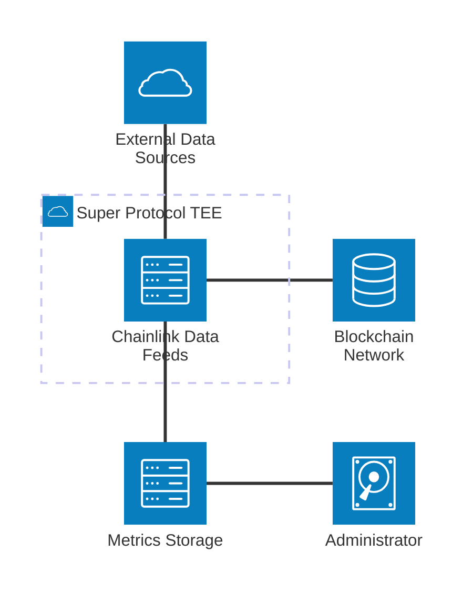

</details>

### 1.3 Key Characteristics

- **All-in-One Container**: Single container deployment containing all components
- **Multi-node Consensus**: Minimum 4 Oracle nodes for Data Feeds consensus via OCR
- **TEE Isolation**: Runs in Intel TDX trusted execution environment
- **Push-based Monitoring**: Metrics pushed to remote Prometheus (no pull access from TEE)
- **Centralized Price Aggregation**: Single Price Aggregator caching layer serving all nodes
- **Process Management**: s6-overlay supervises all services with dependencies and restarts
- **Database Isolation**: Shared PostgreSQL with separate databases per node

---

## 2. Container Architecture

### 2.1 All-in-One Container Structure

The All-in-One container packages all components into a single deployable unit optimized for TEE deployment. This approach simplifies management, reduces the attack surface, and ensures all components share the same trust boundary.

**Diagram**: [charts/02-container-architecture.mmd](charts/02-container-architecture.mmd)

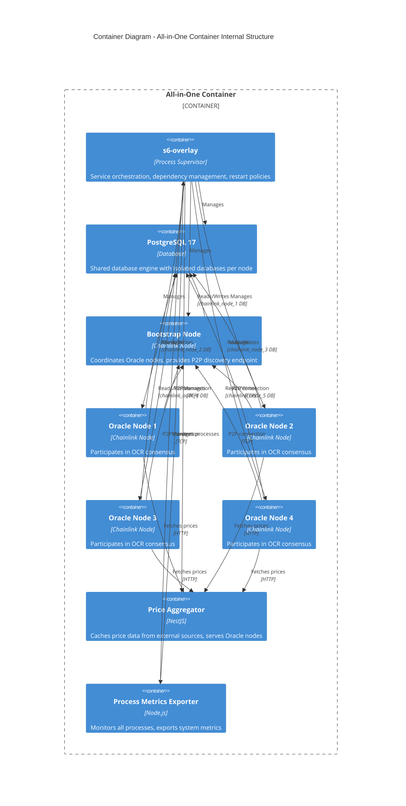

### 2.2 Process Management with s6-overlay

The container uses **s6-overlay v3.2.1.0** as its process supervisor. s6-overlay provides:

- **Service dependencies**: Ensures correct startup order
- **Automatic restarts**: Failed services are automatically restarted
- **Graceful shutdown**: Coordinated shutdown of all services
- **Logging**: Centralized log management with rotation

#### Service Dependency Graph

**Diagram**: [charts/03-service-dependency.mmd](charts/03-service-dependency.mmd)

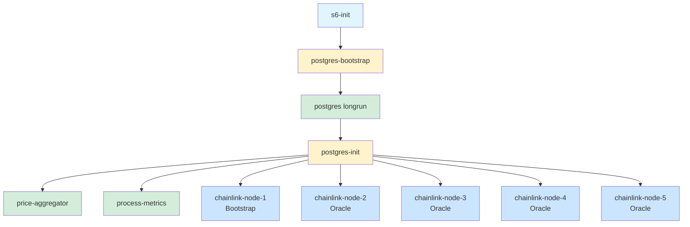

**Legend:**
- Light Blue: Init process
- Yellow: Oneshot services (run once)
- Green: Longrun services (persistent)
- Blue: Chainlink nodes (longrun, dynamically generated)

### 2.3 Initialization Sequence

The container initialization follows this sequence:

1. **s6-overlay init** (`/init` entrypoint)
2. **Service generation** (`entrypoint-allinone.sh` at `/etc/cont-init.d/20-generate-services.sh`)
   - Reads `/sp/configurations/configuration.json`
   - Extracts `totalNodes` count
   - Generates service directories for each Chainlink node in `/etc/services.d/chainlink-node-{i}/`
   - Creates run scripts with unique ports and environment
3. **postgres-bootstrap** (oneshot)
   - Initializes PostgreSQL cluster with `initdb`
   - Applies ephemeral configuration optimized for TEE
   - Enables data checksums for corruption detection
4. **postgres** (longrun)
   - Starts PostgreSQL server as `postgres` user
   - Listens on port 5432
5. **postgres-init** (oneshot)
   - Waits for PostgreSQL to be ready
   - Creates `chainlink` user
   - Creates separate database for each node: `chainlink_node_1`, `chainlink_node_2`, etc.
6. **price-aggregator** (longrun)
   - Reads configuration from `/sp/configurations/configuration.json`
   - Starts NestJS application on configured port (default 3000)
   - Begins caching price data from external sources
7. **process-metrics** (longrun)
   - Starts metrics exporter on port 3003
   - Begins monitoring all s6-managed processes
8. **chainlink-node-1 to chainlink-node-N** (longrun)
   - Each node starts with unique:
     - API port: `BASE_API_PORT + node_number` (default 6601, 6602, etc.)
     - P2P port: `9900 + node_number` (9901, 9902, etc.)
     - Database: `chainlink_node_{node_number}`
     - Working directory: `/chainlink/node-{node_number}`
   - Node 1 acts as Bootstrap node
   - Nodes 2+ act as Oracle nodes connecting to Bootstrap

### 2.4 Service Definitions

All s6-rc service definitions are located in `/etc/s6-overlay/s6-rc.d/`:

| Service | Type | Dependencies | Description |
|---------|------|--------------|-------------|
| `postgres-bootstrap` | oneshot | none | Initializes PostgreSQL cluster |
| `postgres` | longrun | `postgres-bootstrap` | PostgreSQL database server |
| `postgres-init` | oneshot | `postgres` | Creates users and databases |
| `price-aggregator` | longrun | `postgres` | Price caching service |
| `process-metrics` | longrun | `postgres` | System metrics exporter |
| `chainlink-node-{i}` | longrun | `postgres-init` (implicit) | Chainlink nodes (generated dynamically) |

### 2.5 Restart and Failure Handling

Each service has a `finish` script that handles crashes:

- **Max restarts**: 3 attempts (configurable via `MAX_RESTARTS`)
- **Restart counter**: Tracked in `/run/service/{service-name}/restart-count`
- **Container termination**: After max restarts exceeded, s6-svscan terminates, stopping the container
- **Service restart tracking**: Last restart timestamp recorded in `/run/service/{service-name}/last-restart`

This ensures fast recovery from transient failures while preventing infinite restart loops that could hide serious issues.

---

## 3. Solution Components

### 3.1 Chainlink Infrastructure

#### 3.1.1 Bootstrap Node

**Purpose**: The Bootstrap node serves as the coordination point for the Oracle network.

**Key Responsibilities**:
- Provides P2P discovery endpoint for Oracle nodes
- Maintains peer list and network topology
- Facilitates initial connection establishment
- Does NOT participate in OCR consensus or price reporting

**Configuration**:
- Always Node 1 in the deployment
- P2P port: 9901 (default)
- API port: 6601 (default)
- Database: `chainlink_node_1`
- Bootstrap address: `chainlink-node-1:9901`

**Network Role**: Oracle nodes connect to the Bootstrap node address specified in configuration (`bootstrapNodeAddresses` parameter).

#### 3.1.2 Oracle Nodes (Minimum 4 for Data Feeds)

**Purpose**: Oracle nodes participate in the Off-Chain Reporting (OCR) consensus mechanism to aggregate and submit price data to the blockchain.

**Why Minimum 4 Nodes?**
Chainlink Data Feeds using OCR require a minimum of 4 Oracle nodes to achieve consensus and fault tolerance:
- **Byzantine Fault Tolerance**: Can tolerate up to ⌊(n-1)/3⌋ faulty nodes
- **With 4 nodes**: Can tolerate 1 faulty node (⌊3/3⌋ = 1)
- **Consensus requirement**: 2f+1 nodes must agree (with 4 nodes: 3 must agree)
- **Security**: Prevents single point of failure and manipulation

**Key Responsibilities**:
- Fetch price data from Price Aggregator
- Participate in OCR protocol to reach consensus
- Sign aggregated reports
- Submit consensus reports to blockchain smart contracts
- Monitor job specifications from smart contracts

**Configuration per Node**:
| Node | Role | API Port | P2P Port | Database |
|------|------|----------|----------|----------|
| Node 1 | Bootstrap | 6601 | 9901 | chainlink_node_1 |
| Node 2 | Oracle | 6602 | 9902 | chainlink_node_2 |
| Node 3 | Oracle | 6603 | 9903 | chainlink_node_3 |
| Node 4 | Oracle | 6604 | 9904 | chainlink_node_4 |
| Node 5 | Oracle | 6605 | 9905 | chainlink_node_5 |

**Off-Chain Reporting (OCR) Process**:

**Diagram**: [charts/04-ocr-consensus-flow.mmd](charts/04-ocr-consensus-flow.mmd)

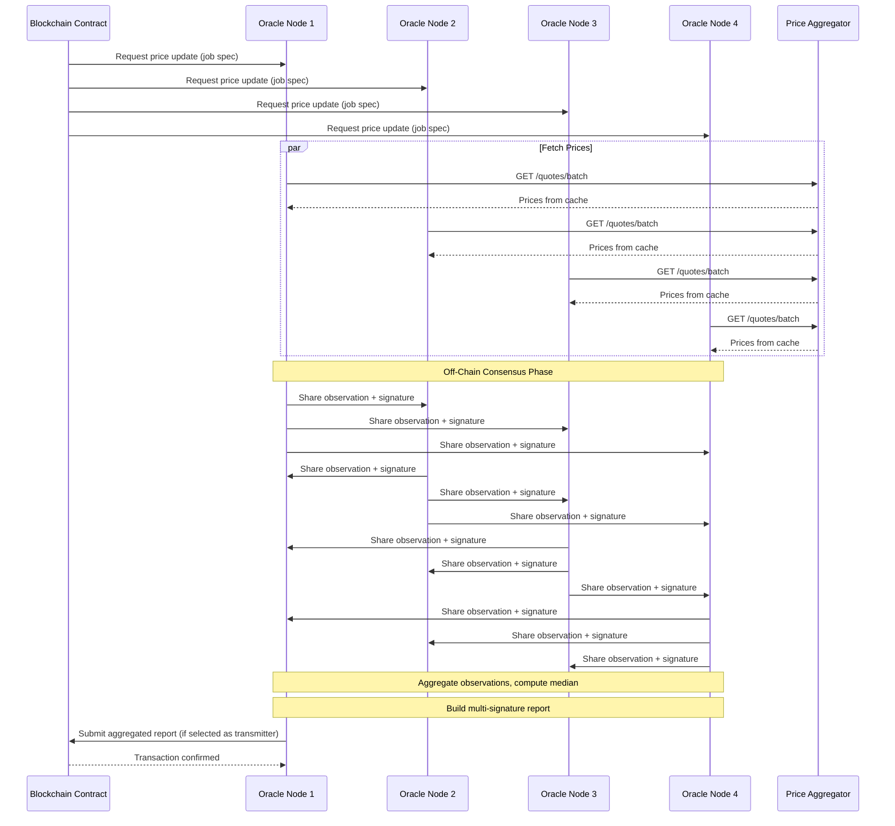

**Inter-node Communication**:
- Protocol: P2P networking via libp2p
- Discovery: Via Bootstrap node
- Consensus: Direct peer-to-peer messaging
- Data source: All nodes query the same Price Aggregator instance

**Job Configuration**:
- Jobs are configured via `join-config` and deployed through admin scripts
- Each job specifies: data source URL, update frequency, threshold parameters
- Price Aggregator URL is injected as environment variable

### 3.2 PostgreSQL

**Purpose**: Shared database engine providing persistent storage for all Chainlink nodes.

**Architecture Approach**: Single PostgreSQL instance with database isolation per node.

**Key Characteristics**:
- **Version**: PostgreSQL 17
- **Data Directory**: `/sp/postgresql/data`
- **Port**: 5432 (internal)
- **User**: `postgres` (superuser), `chainlink` (application user)
- **Max Connections**: 1000

**Database Isolation**:

| Database Name | Owner | Used By |
|---------------|-------|---------|
| `chainlink_node_1` | chainlink | Bootstrap Node (Node 1) |
| `chainlink_node_2` | chainlink | Oracle Node 2 |
| `chainlink_node_3` | chainlink | Oracle Node 3 |
| `chainlink_node_4` | chainlink | Oracle Node 4 |
| `chainlink_node_5` | chainlink | Oracle Node 5 |

**Why Shared PostgreSQL?**
- Reduces resource footprint in TEE environment
- Simplifies backup and management
- Database isolation still provides logical separation
- Each node cannot access other nodes' data

**Configuration Optimizations for TEE**:

PostgreSQL is configured for ephemeral, cache-only usage in TEE:

```sql
-- Crash-safety and bounded WAL growth
fsync = on
full_page_writes = on
synchronous_commit = on
wal_level = replica
archive_mode = off
wal_keep_size = 0
max_wal_size = 256MB
min_wal_size = 64MB
checkpoint_timeout = 5min
checkpoint_completion_target = 0.9
shared_buffers = 128MB
autovacuum = on

-- No replication needed
max_wal_senders = 0
max_replication_slots = 0

-- Data integrity
data_checksums = enabled (via initdb)
```

**Key Points**:
- Data is ephemeral (not persisted outside container)
- Optimized for short-lived workloads
- Limited WAL to prevent disk exhaustion on overlay filesystem
- Data checksums detect corruption early

### 3.3 Price Aggregator

**Purpose**: Centralized caching layer that fetches and aggregates price data from multiple external sources, serving all Oracle nodes with consistent, fresh data.

**Architecture**: NestJS-based microservice with modular design.

**Diagram**: [charts/05-price-aggregator-components.mmd](charts/05-price-aggregator-components.mmd)

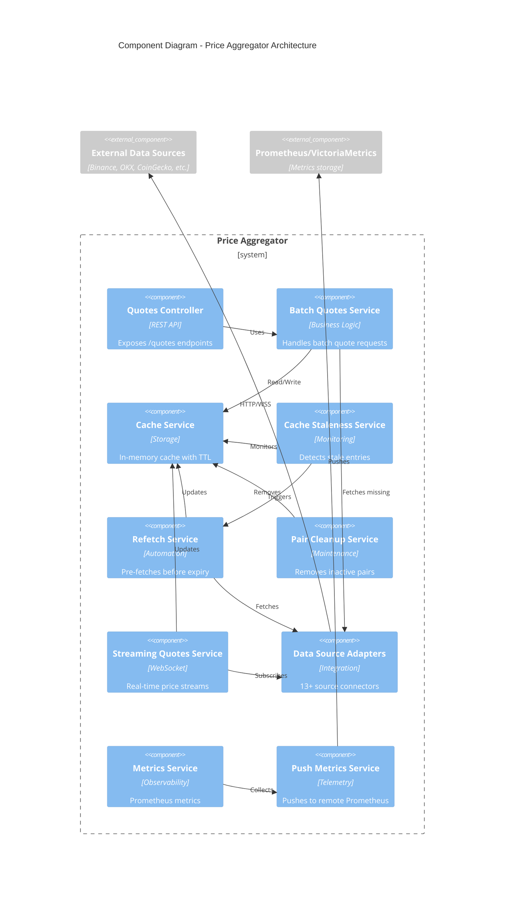

#### 3.3.1 Caching Layer

**TTL Mechanism**:
- Each data source has configurable TTL (default: 5 minutes / 300,000ms)
- Cache entries expire based on source TTL
- Expired entries are removed and trigger refetch

**Data Freshness Guarantees**:
- **Pre-fetching strategy**: `staleTriggerBeforeExpiry` parameter (default 5 seconds)
- Cache entry marked as "stale" before actual expiration
- Refetch Service triggered to refresh before expiry
- Ensures Oracle nodes always get fresh data without cache misses

**Inactive Pairs Cleanup**:
- Pairs not requested for 10 minutes (configurable) are removed from cache
- Cleanup runs every 20 seconds
- Prevents memory bloat from unused trading pairs

#### 3.3.2 External Sources Integration

**Supported Data Sources** (13+ sources):

| Source | RPS Limit | Batch Size | API Key Required | Streaming Support |
|--------|-----------|------------|------------------|-------------------|
| Binance | 100 | 500 | No | Yes (WebSocket) |
| OKX | 10 | 200 | No | Yes (WebSocket) |
| CoinGecko | 1 | 100 | No | No |
| Kraken | 1 | 50 | No | Yes (WebSocket) |
| Coinbase | 2.8 | - | No | Yes (WebSocket) |
| CryptoCompare | 25 | 50 | Yes | Yes (WebSocket) |
| Finnhub | 1 | - | Yes | Yes (WebSocket) |
| AlphaVantage | 1 | - | Yes | No |
| ExchangeRateHost | 1 | - | No | No |
| Frankfurter | 10 | - | No | No |
| Yahoo Finance | 10 | - | No | No |
| KuCoin | 30 | - | No | No |
| Bybit | 120 | - | No | No |

**Rate Limiting and Throttling**:
- Per-source RPS (requests per second) limits
- Per-source max concurrent requests
- Automatic throttling to prevent API bans
- Retry logic with exponential backoff (max 3 retries)

**Batch Requests Optimization**:
- Supports batch requests for sources that allow it
- Reduces number of API calls
- Configurable batch sizes per source

**WebSocket Streams**:
- Real-time price updates for selected sources
- Automatic reconnection on disconnect
- Heartbeat monitoring
- Subscription batching to avoid rate limits

**Proxy Support**:
- Global proxy configuration
- Per-source proxy override
- Required for some sources with geo-restrictions

#### 3.3.3 Traffic Optimization

**Centralized Data Fetching**:
- Single Price Aggregator instance serves all Oracle nodes
- Avoids duplicate requests to external APIs
- Shared cache reduces external API load by ~80%

**Example**: Without Price Aggregator (4 Oracle nodes × 100 pairs × 10 requests/min) = 4,000 requests/min to external APIs. With Price Aggregator: ~1,000 requests/min (4× reduction).

**Batch Processing**:
- Oracle nodes request multiple pairs in single HTTP call
- Price Aggregator efficiently batches requests to sources
- Reduces network overhead and latency

#### 3.3.4 Prometheus Metrics Export

**Collected Metrics**:
- Request rates per endpoint
- Cache hit/miss ratios
- Source availability and latency
- Active pairs count
- Stale entries detected
- Refetch operations
- WebSocket connection status

**Push Gateway Integration**:
- Metrics pushed every 15 seconds (configurable)
- Target: VictoriaMetrics or Prometheus with remote write
- Basic authentication support
- Custom grouping labels (service, instance, environment)

**Data Source Metrics**:
- Per-source request counts
- Per-source error rates
- Per-source response times

**Performance Metrics**:
- Memory usage
- Cache size
- Request processing time
- Concurrent request count

### 3.4 Process Metrics Exporter

**Purpose**: Monitors resource usage of all container processes and exports system-level metrics to remote Prometheus.

**Architecture**: Lightweight Node.js service.

**Key Capabilities**:

1. **Process Resource Monitoring**:
   - CPU usage per process (%)
   - Memory usage per process (RSS in KB)
   - Process ID tracking
   - Process name identification

2. **Service Discovery**:
   - Discovers s6-overlay managed services from `/etc/s6-overlay/s6-rc.d/`
   - Discovers runtime services from `/run/service/`
   - Refreshes service list every 60 seconds (configurable)

3. **Metrics Collection**:
   - Uses `s6-svstat` to get PIDs
   - Uses `ps` command to get resource stats
   - Sampling interval: 5 seconds (configurable)

4. **s6 Service Metrics**:
   - Service restart count
   - Last restart timestamp
   - Helps identify unstable services

**Exported Metrics**:

| Metric Name | Type | Description |
|-------------|------|-------------|
| `chainlink_process_list` | gauge | List of tracked processes with PID |
| `chainlink_process_cpu_percent` | gauge | CPU usage per process |
| `chainlink_process_memory_rss_kb` | gauge | RSS memory per process |
| `chainlink_s6_service_restart_count` | counter | Number of service restarts |
| `chainlink_s6_service_last_restart_ts` | gauge | Unix timestamp of last restart |

**Push Mechanism**:
- Push protocol: Prometheus Pushgateway format (PUT method)
- Endpoint format: `/metrics/job/{job}/instance/{instance}/...`
- TTL support: Metrics include TTL label and query parameter (default 3600s)
- Configuration via environment or `/etc/process-metrics/config.json`

**Self-Healing**:
- Exits after 12 consecutive sampling failures
- s6-overlay restarts the service
- finish script prevents infinite loops

**Why Process Metrics Matter in TEE**:
- No SSH access to container
- No traditional monitoring agents
- Process metrics are only visibility into system health
- Critical for detecting resource exhaustion, memory leaks, CPU spikes

---

## 4. Network Architecture

### 4.1 Ports and Endpoints

#### Internal Ports (Container-local)

| Port | Service | Protocol | Purpose | Access |
|------|---------|----------|---------|--------|
| 5432 | PostgreSQL | TCP | Database connections | Internal only |
| 3000 | Price Aggregator | HTTP | REST API for quotes | Internal only |
| 3003 | Process Metrics Exporter | HTTP | Metrics endpoint | Internal only |
| 6601 | Bootstrap Node API | HTTP | Chainlink UI & API | Internal only |
| 6602-6605 | Oracle Nodes API | HTTP | Chainlink UI & API | Internal only |
| 9901 | Bootstrap Node P2P | TCP | P2P discovery | Internal only |
| 9902-9905 | Oracle Nodes P2P | TCP | P2P consensus | Internal only |

**Note**: In the All-in-One container, all ports are internal. External access would be configured via Super Protocol infrastructure if needed.

#### External Endpoints (Outbound)

| Endpoint | Service | Purpose | Protocol |
|----------|---------|---------|----------|
| Blockchain RPC | Oracle Nodes | Submit transactions, read contracts | HTTPS/WSS |
| External Data Sources | Price Aggregator | Fetch price data | HTTPS/WSS |
| Prometheus/VictoriaMetrics | Price Aggregator, Process Metrics | Push metrics | HTTPS |

### 4.2 Internal Interactions

**Diagram**: [charts/06-internal-network.mmd](charts/06-internal-network.mmd)

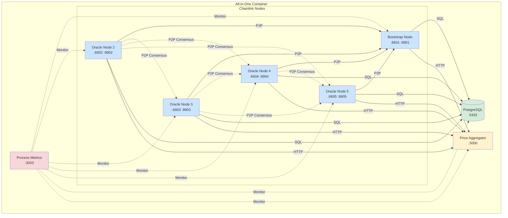

**Connection Details**:

1. **Oracle Nodes ↔ Bootstrap Node**:
   - Protocol: libp2p over TCP
   - Purpose: P2P network discovery and peer list maintenance
   - Bootstrap address: `chainlink-node-1:9901`

2. **Oracle Nodes ↔ Oracle Nodes**:
   - Protocol: libp2p over TCP (direct peer connections)
   - Purpose: OCR consensus messages, observation sharing
   - Mesh topology after discovery

3. **All Nodes ↔ PostgreSQL**:
   - Protocol: PostgreSQL wire protocol (TCP)
   - Endpoint: `localhost:5432`
   - Authentication: Username/password
   - Each node connects to its own database

4. **All Nodes ↔ Price Aggregator**:
   - Protocol: HTTP/1.1
   - Endpoint: `http://localhost:3000` (configurable via `PRICE_AGGREGATOR_PORT`)
   - Main endpoint: `GET /quotes/batch?pairs=BTC-USD,ETH-USD,...`
   - Response: JSON with prices and metadata

5. **Process Metrics Exporter ↔ All Services**:
   - Uses system calls (`s6-svstat`, `ps`) to monitor
   - No network communication required
   - Read-only monitoring

### 4.3 External Interactions

**Diagram**: [charts/07-external-network.mmd](charts/07-external-network.mmd)

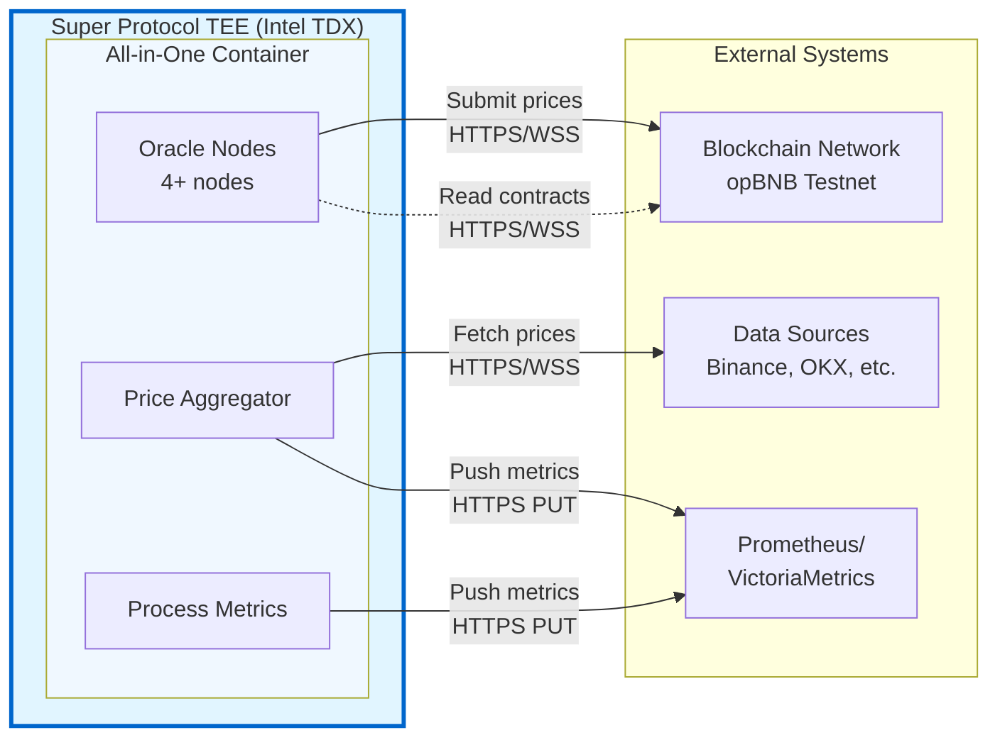

**Connection Details**:

1. **Oracle Nodes → Blockchain Network**:
   - **HTTP RPC**: `https://opbnb-testnet-rpc.publicnode.com`
     - Purpose: Submit transactions, query state
     - Methods: eth_sendRawTransaction, eth_getTransactionReceipt, etc.
   - **WebSocket RPC**: `wss://opbnb-testnet-rpc.publicnode.com`
     - Purpose: Real-time event monitoring
     - Subscribe to contract events, new blocks
   - **Smart Contracts**:
     - Diamond Contract: Aggregator logic
     - Admin Contract: Configuration management

2. **Price Aggregator → External Data Sources**:
   - **REST APIs**: HTTPS requests to 13+ sources
   - **WebSocket Streams**: Real-time price feeds (Binance, OKX, Kraken, etc.)
   - **Proxy Support**: Optional HTTP/HTTPS proxy for geo-restricted sources
   - **Rate Limiting**: Per-source throttling to respect API limits

3. **Price Aggregator, Process Metrics → Prometheus/VictoriaMetrics**:
   - **Protocol**: HTTP PUT (Pushgateway format)
   - **Endpoint**: `https://metrics-receiver.tech.superprotocol.com/api/v1/import/prometheus`
   - **Authentication**: Basic Auth (username/password)
   - **Frequency**:
     - Price Aggregator: 15 seconds
     - Process Metrics: 5 seconds (configurable)
   - **Format**: Prometheus text exposition format

### 4.4 Security Considerations in Super Protocol TEE

**Network Isolation**:
- Container runs in isolated TEE environment
- No inbound connections from outside Super Protocol
- Only outbound connections allowed (to whitelisted endpoints)
- Internal network fully isolated from host

**TLS/SSL**:
- All external HTTPS connections use TLS 1.2+
- Certificate validation enforced
- Blockchain RPC endpoints must use HTTPS/WSS

**Secrets Protection**:
- Private keys stored in `/sp/secrets/` directory
- Keys never transmitted outside TEE
- Encrypted at rest within TEE
- Accessible only to authorized processes

**Attack Surface Minimization**:
- No exposed ports to external network
- No SSH/shell access
- All management via configuration
- Single container reduces attack surface vs. multi-container

**Authentication**:
- PostgreSQL: Username/password authentication
- Chainlink UI: Email/password (not exposed externally)
- External APIs: API keys stored in configuration
- Metrics push: Basic authentication

### 4.5 DNS and Service Discovery

**Internal DNS**:
- Bootstrap node hostname: `chainlink-node-1`
- Oracle nodes hostnames: `chainlink-node-2`, `chainlink-node-3`, etc.
- Services accessible via `localhost` within container

**External DNS**:
- Blockchain RPC: Public DNS resolution
- Data sources: Public DNS resolution
- Metrics endpoint: Super Protocol managed DNS

---

## 5. Data Flow Diagrams

### 5.1 Price Data Flow

This diagram shows the complete flow of price data from external sources through the Price Aggregator to Oracle nodes, and finally to the blockchain.

**Diagram**: [charts/08-price-data-flow.mmd](charts/08-price-data-flow.mmd)

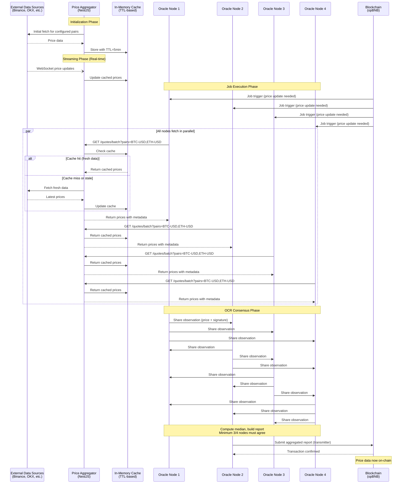

**Key Points**:
1. **Cache-first approach**: Price Aggregator checks cache before external requests
2. **TTL-based expiry**: Data refreshed before expiry (staleTriggerBeforeExpiry)
3. **Streaming updates**: WebSocket connections keep cache fresh in real-time
4. **Parallel fetching**: All Oracle nodes fetch simultaneously, same data from cache
5. **Consensus**: 3 out of 4 nodes must agree on median price
6. **Single transmitter**: One node (selected by OCR) submits final report

### 5.2 Metrics Flow

Two separate metrics flows exist: application metrics from Price Aggregator and system metrics from Process Metrics Exporter.

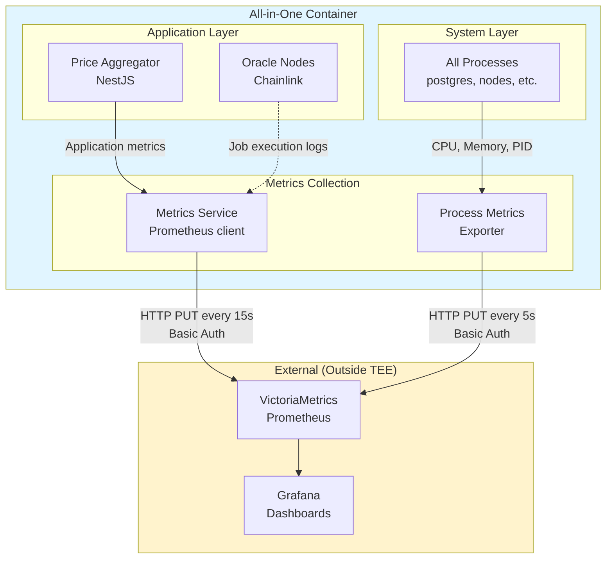

**Application Metrics** (from Price Aggregator):
- Request rates per endpoint
- Cache hit/miss ratios
- Source availability (up/down)
- Source response times
- Active trading pairs count
- Refetch operations count
- WebSocket connection status

**System Metrics** (from Process Metrics Exporter):
- Per-process CPU usage
- Per-process memory (RSS)
- Service restart counts
- Service last restart timestamps
- Process list with PIDs

**Push Strategy** (Required for TEE):
- **Why push?** No inbound access to TEE, pull-based scraping impossible
- **Authentication**: Basic auth with username/password
- **Format**: Prometheus text exposition format
- **Reliability**: Retries on failure, TTL ensures stale metrics expire
- **Grouping labels**: Distinguish metrics by service, instance, environment

### 5.3 Database Flow

PostgreSQL provides isolated storage for each Chainlink node while sharing the same database engine.

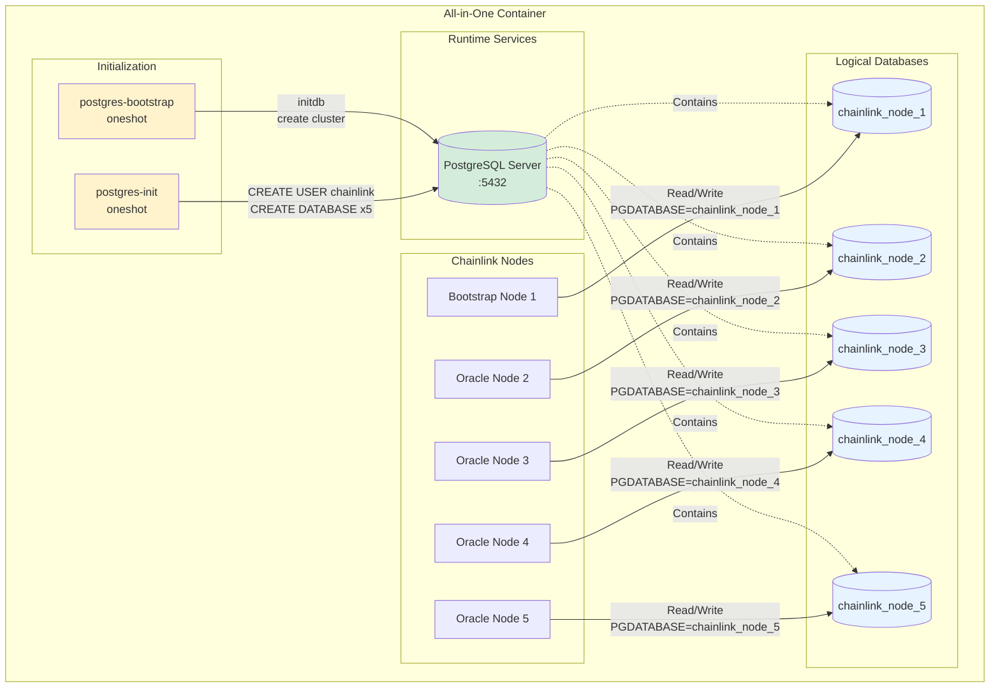

**Database Initialization Flow**:

1. **postgres-bootstrap** (oneshot):
   - Check if `/sp/postgresql/data` is empty
   - If empty, run `initdb` to create database cluster
   - Apply ephemeral configuration (limited WAL, data checksums)
   - Set ownership to `postgres` user

2. **postgres** (longrun):
   - Start PostgreSQL server as `postgres` user
   - Listen on `localhost:5432`
   - Load configuration from `postgresql.conf`

3. **postgres-init** (oneshot):
   - Wait for PostgreSQL to accept connections (`pg_isready`)
   - Create application user: `CREATE USER chainlink WITH PASSWORD '...'`
   - Create databases:
     - `CREATE DATABASE chainlink_node_1 OWNER chainlink`
     - `CREATE DATABASE chainlink_node_2 OWNER chainlink`
     - ... (repeat for all nodes)

4. **Chainlink nodes** (longrun):
   - Connect to PostgreSQL with:
     - Host: `localhost`
     - Port: `5432`
     - User: `chainlink`
     - Password: from configuration
     - Database: `chainlink_node_{NODE_NUMBER}`
   - Each node has exclusive access to its database
   - Nodes cannot see other nodes' data (database isolation)

**What's Stored in Database**:
- Job specifications and runs
- Transaction history
- Node configuration
- Encryption keys (encrypted)
- P2P peer information
- OCR state and rounds

**Ephemeral Nature**:
- Data NOT persisted outside container
- On container restart, database is reinitialized
- Configuration and keys restored from `/sp/secrets/` and `/sp/configurations/`
- Stateless design suitable for TEE

### 5.4 Configuration Flow

Configuration flows from Super Protocol infrastructure into the container at startup.

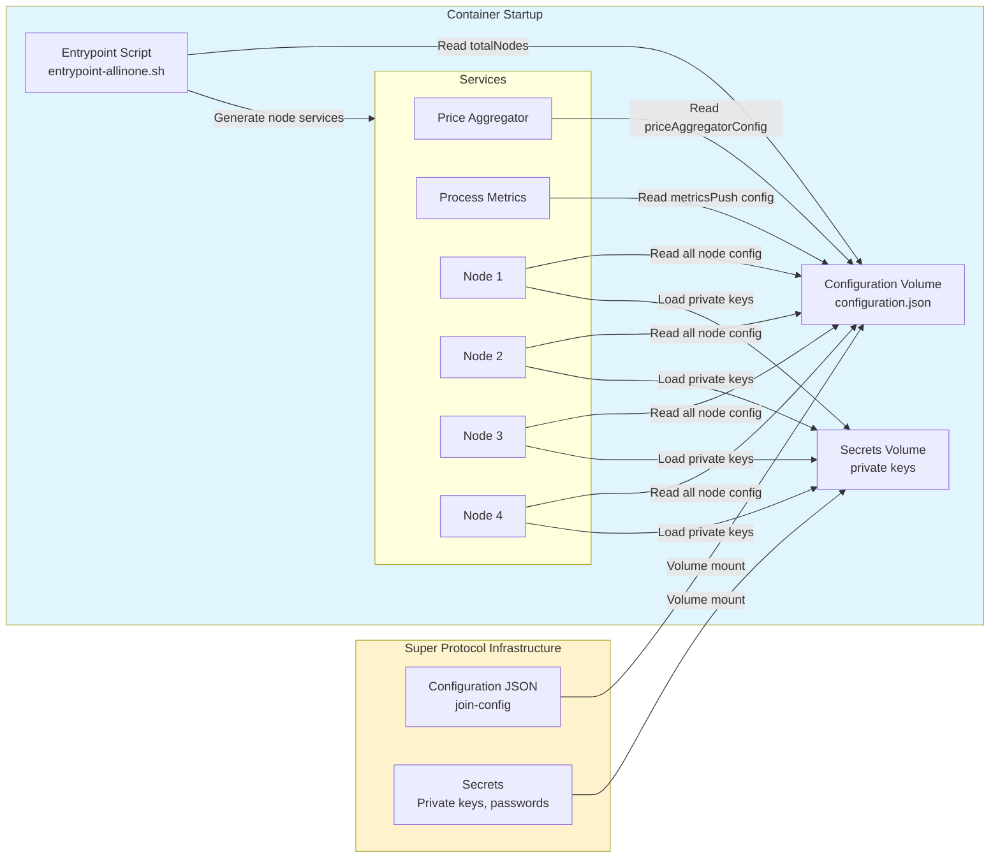

**Configuration Sources**:

1. **/sp/configurations/configuration.json**:
   - Main configuration file
   - Contains all solution parameters
   - Structured JSON with nested objects
   - Read by: entrypoint script, Price Aggregator, Process Metrics, all nodes

2. **/sp/secrets/**:
   - Private keys for each Oracle node
   - Faucet private key for balance top-ups
   - Database passwords
   - API keys for external services
   - Encrypted at rest, decrypted on load

**Configuration Sections**:
- `solution.totalNodes`: Number of nodes to create
- `solution.priceAggregatorConfig`: Price Aggregator settings
- `solution.priceAggregatorConfig.metricsPush`: Metrics push config
- Node-specific: RPC URLs, chain ID, contract addresses
- Database: Connection parameters
- Balance top-up: Faucet settings

---

## 6. Deployment Architecture

### 6.1 Build Process

The All-in-One container is built using a multi-stage approach defined in `dockerfile.allinone`.

**Base Image**: `smartcontract/chainlink:2.27.0`

**Build Stages**:

1. **System Dependencies Installation**:
   - PostgreSQL 17
   - Node.js 22.18.0 (via nvm)
   - s6-overlay 3.2.1.0
   - System tools: jq, gettext, curl, make

2. **Application Installation**:
   - Copy scripts/ → /scripts
   - npm ci in /scripts (Node.js utilities)
   - Copy price-aggregator/ → /price-aggregator
   - npm ci and npm run build in /price-aggregator
   - Copy data-feed-generator templates → /templates

3. **s6-overlay Configuration**:
   - Copy aio/s6-rc.d → /etc/s6-overlay/s6-rc.d
   - Copy entrypoint-allinone.sh → /etc/cont-init.d/
   - Set executable permissions

4. **Entrypoint Configuration**:
   - `ENTRYPOINT ["/init"]`
   - `CMD []`

**Build Arguments**:
- `NODE_VERSION`: Node.js version (default: 22.18.0)
- `CONFIGURATION_PUBLIC_KEY`: Public key for configuration verification

### 6.2 GitHub Actions CI/CD Pipeline

The container build and deployment is automated via GitHub Actions (`.github/workflows/`).

**Workflow Triggers**:
- Push to main branch
- Pull request
- Manual workflow dispatch
- Tagged releases

**Build Steps**:
1. Checkout repository
2. Set up Docker Buildx
3. Log in to container registry
4. Build All-in-One image with cache
5. Tag image with commit SHA and version
6. Push to registry
7. Run verification tests (optional)

**Artifacts**:
- Docker image: `ghcr.io/...chainlink-allinone:version`
- Build metadata
- Deployment configuration

### 6.3 Deployment to Super Protocol TEE

**Deployment Flow**:

1. **Image Preparation**:
   - Build All-in-One container image
   - Push to container registry accessible by Super Protocol
   - Generate image hash for verification

2. **Configuration Preparation**:
   - Create `join-config.json` with all parameters
   - Sign configuration with private key
   - Store secrets in Super Protocol secrets vault

3. **TEE Deployment**:
   - Super Protocol creates TEE instance (Intel TDX)
   - Loads container image into isolated environment
   - Mounts configuration and secrets volumes:
     - `/sp/configurations/configuration.json`
     - `/sp/secrets/` directory
   - Starts container with `/init` entrypoint

4. **Initialization**:
   - s6-overlay starts
   - `entrypoint-allinone.sh` reads configuration
   - Generates Chainlink node services
   - Starts all services in dependency order

5. **Runtime**:
   - Container runs until stopped or crashed
   - Metrics pushed to remote Prometheus
   - No direct access to container

**Super Protocol Integration Points**:
- Volume mounts for configuration and secrets
- Network policies for outbound connections
- Metrics endpoint whitelisting
- Attestation verification (if enabled)

### 6.4 Health Checks and Readiness

**Service-level Health**:
- s6-overlay monitors each service via supervise
- Restart on failure (up to MAX_RESTARTS)
- finish scripts track restart counts

**Application Health**:
- PostgreSQL: `pg_isready` check
- Price Aggregator: HTTP endpoint `/healthz` (if configured)
- Process Metrics: HTTP endpoint `/healthz`
- Chainlink nodes: API health endpoints

**No External Health Probes**:
- TEE isolation prevents external health checks
- Rely on metrics to indicate health
- Service crashes visible in restart counts

---

## 7. Monitoring & Observability

### 7.1 Metrics Architecture

The monitoring architecture is designed for the constraints of TEE environments where traditional pull-based monitoring is impossible.

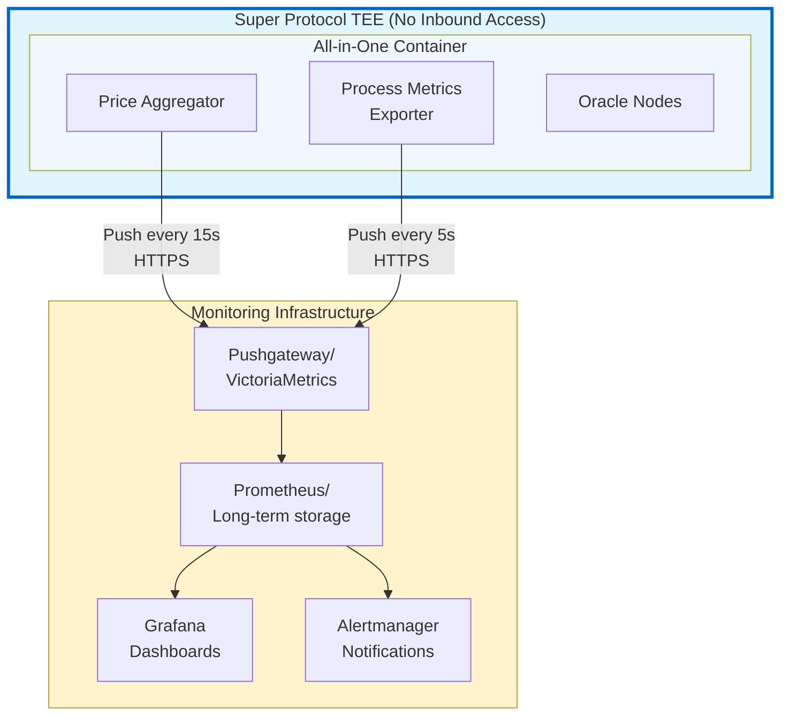

### 7.2 Application-Level Metrics (Price Aggregator)

**Category: HTTP Requests**
- `http_requests_total`: Counter of requests by endpoint, method, status
- `http_request_duration_seconds`: Histogram of request latency
- `http_requests_in_flight`: Gauge of concurrent requests

**Category: Cache Performance**
- `cache_hits_total`: Counter of cache hits
- `cache_misses_total`: Counter of cache misses
- `cache_hit_ratio`: Gauge of hit/(hit+miss)
- `cache_entries_total`: Gauge of cached pairs count
- `cache_stale_entries`: Gauge of entries needing refresh

**Category: Data Sources**
- `source_requests_total`: Counter by source, status
- `source_request_duration_seconds`: Histogram by source
- `source_availability`: Gauge (1=up, 0=down) by source
- `source_errors_total`: Counter of errors by source, type

**Category: WebSocket Streams**
- `websocket_connections`: Gauge by source
- `websocket_reconnects_total`: Counter by source
- `websocket_messages_received`: Counter by source

**Category: Refetch Operations**
- `refetch_operations_total`: Counter of refetch triggers
- `refetch_duration_seconds`: Histogram of refetch time
- `prefetch_success_rate`: Gauge

### 7.3 System-Level Metrics (Process Metrics Exporter)

**Category: Process Resources**
- `chainlink_process_cpu_percent`: Gauge by service, process, pid
- `chainlink_process_memory_rss_kb`: Gauge by service, process, pid
- `chainlink_process_list`: Gauge (1=running) by service, process, pid

**Category: Service Health**
- `chainlink_s6_service_restart_count`: Counter by service
- `chainlink_s6_service_last_restart_ts`: Gauge (unix timestamp) by service

**Label Dimensions**:
- `service`: Service name (chainlink-node-1, postgres, price-aggregator, etc.)
- `process`: Process name from ps command
- `pid`: Process ID
- `instance`: Instance identifier (from configuration)
- `environment`: dev/staging/production
- `ttl`: Time-to-live in seconds

### 7.4 Dashboards

**Recommended Grafana Dashboards**:

1. **Overview Dashboard**:
   - Container health summary
   - All services status (restart counts)
   - Resource usage overview (CPU, Memory)
   - Alert summary

2. **Price Aggregator Dashboard**:
   - Request rate and latency
   - Cache hit ratio over time
   - Source availability matrix
   - Active pairs count
   - WebSocket connection status
   - Error rates by source

3. **Process Metrics Dashboard**:
   - Per-process CPU usage (time series)
   - Per-process memory usage (time series)
   - Service restart timeline
   - Process count by service

4. **Oracle Nodes Health Dashboard**:
   - Node process status
   - Resource usage per node
   - Job execution metrics (if available from Chainlink)
   - Database connection status

5. **Data Feeds Performance Dashboard**:
   - Price update frequency
   - Consensus success rate
   - Transaction submission metrics
   - Blockchain interaction latency

### 7.5 Alerting Strategy

**Critical Alerts**:
- Service restart count > 2 in 5 minutes
- Process metrics exporter not reporting (no data for 1 minute)
- Price Aggregator not reporting (no data for 1 minute)
- Any node process CPU > 90% for 5 minutes
- Any node process memory > 80% of limit

**Warning Alerts**:
- Cache hit ratio < 70%
- Any data source unavailable > 5 minutes
- WebSocket disconnect > 3 times in 10 minutes
- Database connection errors

**Alert Channels**:
- Slack/Discord notifications
- Email
- PagerDuty (for critical)
- Webhook to Super Protocol monitoring

### 7.6 Logging

**Log Locations** (within container):
- PostgreSQL: `/var/log/postgresql/`
- Price Aggregator: `/var/log/price-aggregator/`
- Process Metrics: `/var/log/process-metrics/`
- Chainlink Nodes: `/chainlink/node-{i}/logs/` (via node logging)

**Log Rotation**:
- Managed by s6-log
- Max file size: 10 MB
- Keep last 10 files
- Automatic rotation and cleanup

**Log Aggregation**:
- No log aggregation in TEE (isolation)
- Logs accessible only via container restart or debugging
- Critical information exported as metrics

### 7.7 Operational Visibility Limitations

**What You CAN Monitor**:
- ✅ All metrics pushed to Prometheus
- ✅ Service restart events
- ✅ Resource usage (CPU, memory)
- ✅ Application performance (latency, throughput)
- ✅ External API health

**What You CANNOT Monitor**:
- ❌ Real-time log tailing
- ❌ Shell access to container
- ❌ Network packet inspection
- ❌ File system browsing
- ❌ Process debugging (strace, gdb)

**Mitigation**:
- Comprehensive metrics coverage
- Proactive alerting
- Self-healing mechanisms
- Detailed error metrics
- Pre-deployment testing

---

## 8. Super Protocol TEE Considerations

### 8.1 Intel TDX Environment

**Trust Execution Environment (TEE)** powered by Intel TDX (Trust Domain Extensions):

- **Hardware-level Isolation**: CPU enforces memory encryption and isolation
- **Attestation**: Cryptographic proof of code integrity (optional)
- **Secure Boot**: Verified boot process
- **Memory Encryption**: All memory encrypted with CPU-generated keys
- **No Host Access**: Host OS cannot access TEE memory or state

**Implications for Architecture**:
- Data confidentiality guaranteed by hardware
- Private keys never exposed to host
- Code cannot be modified at runtime
- Strong security boundary

### 8.2 Super Protocol Infrastructure Integration

**Configuration Delivery**:
- Super Protocol manages configuration signing and delivery
- Configuration verified before use (signature check)
- Volume mounts provide configuration and secrets

**Secrets Management**:
- Private keys stored in `/sp/secrets/`
- Encrypted at rest within TEE
- Never transmitted outside TEE
- Automatic key generation (if needed) on first start

**Network Policies**:
- Outbound connections only
- Whitelist of allowed endpoints:
  - Blockchain RPC
  - Data sources
  - Metrics endpoint
- No inbound connections (except from Super Protocol control plane if needed)

### 8.3 Operational Constraints

**No Direct Access**:
- No SSH, kubectl, or shell access
- No filesystem browsing
- No live debugging tools
- All management via configuration and metrics

**No Traditional Maintenance**:
- Cannot hotfix files
- Cannot restart individual services manually
- Cannot inspect logs in real-time
- Must redeploy entire container for changes

**Limited Troubleshooting**:
- Rely entirely on metrics for diagnosis
- Cannot attach debugger
- Cannot inspect network traffic
- Must reproduce issues externally

### 8.4 Security Model

**Threat Model**:
- **Protected Against**:
  - Host OS compromise
  - Hypervisor attacks
  - Physical memory dumps
  - Side-channel attacks (partially)
  - Malicious operators

- **Not Protected Against**:
  - Vulnerabilities in container code
  - Misconfiguration
  - Compromised external APIs
  - Blockchain network issues

**Secrets Protection**:
- Private keys never leave TEE
- All signing operations within TEE
- No key export functionality
- Automatic key rotation (if configured)

**Configuration Integrity**:
- Signed configuration enforced
- Public key embedded in container image
- Signature verification on startup
- Reject invalid configurations

### 8.5 Failure Scenarios and Recovery

**Container Crash**:
- Super Protocol restarts container
- Database reinitialized (ephemeral)
- Configuration and keys loaded from volumes
- Services start from clean state

**Service Crash Inside Container**:
- s6-overlay restarts service automatically
- Tracked in restart metrics
- After max restarts, container terminates

**Network Partition**:
- Metrics stop flowing → alerts fire
- Price Aggregator cannot fetch data
- Oracle nodes cannot submit to blockchain
- Automatic recovery when network restored

**External API Unavailability**:
- Price Aggregator marks source as down
- Falls back to other sources
- Metrics show source unavailability
- Automatic recovery when API restored

**Database Corruption**:
- Data checksums detect corruption early
- Container restart triggers clean reinit
- Stateless design allows fast recovery

### 8.6 Performance Considerations

**Resource Limits** (recommended):
- CPU: 4-8 vCPUs
- Memory: 8-16 GB RAM
- Disk: 20-50 GB (ephemeral)
- Network: 100 Mbps+

**Scaling Strategy**:
- Vertical scaling only (within TEE limits)
- Cannot horizontally scale within single TEE
- Multiple TEE instances possible (separate deployments)

**Optimization for TEE**:
- Minimal disk I/O (ephemeral storage)
- Limited WAL size for PostgreSQL
- In-memory caching for Price Aggregator
- Efficient metrics push (avoid polling)

---

## 9. Technology Stack

### 9.1 Core Technologies

| Component | Technology | Version | Purpose |
|-----------|-----------|---------|---------|
| **Container Runtime** | Docker | 20+ | Container packaging and execution |
| **Process Supervisor** | s6-overlay | 3.2.1.0 | Service orchestration and management |
| **Operating System** | Debian-based | - | Base OS from Chainlink image |

### 9.2 Chainlink Infrastructure

| Component | Technology | Version | Purpose |
|-----------|-----------|---------|---------|
| **Oracle Nodes** | Chainlink | 2.27.0 | Oracle network and OCR consensus |
| **P2P Networking** | libp2p | - | Peer-to-peer communication |
| **Blockchain Client** | EVM-compatible | - | Blockchain interaction |

### 9.3 Database

| Component | Technology | Version | Purpose |
|-----------|-----------|---------|---------|
| **Database** | PostgreSQL | 17 | Persistent storage for nodes |
| **Client Libraries** | pg (Node.js) | - | Database connectivity |

### 9.4 Price Aggregator

| Component | Technology | Version | Purpose |
|-----------|-----------|---------|---------|
| **Framework** | NestJS | 10.x | Application framework |
| **Runtime** | Node.js | 22.18.0 | JavaScript runtime |
| **HTTP Client** | axios | - | External API requests |
| **WebSocket** | ws | - | Real-time data streams |
| **Caching** | In-memory (Map) | - | Price data caching |
| **Metrics** | prom-client | - | Prometheus metrics |
| **Schema Validation** | @sinclair/typebox | - | Configuration validation |

### 9.5 Process Metrics Exporter

| Component | Technology | Version | Purpose |
|-----------|-----------|---------|---------|
| **Runtime** | Node.js | 22.18.0 | JavaScript runtime |
| **HTTP Server** | Node.js http | - | Metrics endpoint |
| **Process Monitor** | ps, s6-svstat | - | System metrics collection |

### 9.6 External Dependencies

| Service | Provider | Purpose |
|---------|----------|---------|
| **Blockchain** | opBNB Testnet | Price data submission |
| **Data Sources** | Binance, OKX, CoinGecko, Kraken, Coinbase, etc. | Price data fetching |
| **Metrics Storage** | VictoriaMetrics/Prometheus | Metrics aggregation |
| **Dashboards** | Grafana | Visualization |

### 9.7 Development Tools

| Tool | Purpose |
|------|---------|
| **Docker** | Container building and testing |
| **Node.js** | Development runtime |
| **npm** | Package management |
| **TypeScript** | Type-safe development (Price Aggregator) |
| **GitHub Actions** | CI/CD pipeline |
| **jq** | JSON processing in scripts |

---

## 10. Configuration & Secrets

### 10.1 Configuration File Structure

The main configuration file is `/sp/configurations/configuration.json` (based on `join-config.json`).

**Top-Level Structure**:
```json
{
  "adminContractAddress": "0x070512240f52F6B5B4EeE9C89A9E3f48486954CE",
  "diamondContractAddress": "0x9CcBf0aABa30404B812414081c3F3789aa17E4eC",
  "bootstrapNodeAddresses": "chainlink-node-1:9901",
  "bootstrapNodes": "1",
  "totalNodes": "5",
  "nodesList": "1 2 3 4 5",
  "primaryNodes": "1 2 3 4 5",
  "chainlinkChainId": 5611,
  "chainlinkRpcHttpUrl": "https://opbnb-testnet-rpc.publicnode.com/",
  "chainlinkRpcWsUrl": "wss://opbnb-testnet-rpc.publicnode.com/",
  "pgDatabase": "chainlink_node",
  "pgPort": 5432,
  "pgUser": "postgres",
  "pgPassword": "mysecretpassword",
  "priceAggregatorConfig": {
    "port": 3000,
    "sources": {},
    "metricsPush": {}
  },
  "signature": "0xabcd1234..."
}
```

### 10.2 Key Configuration Parameters

**Node Configuration**:

| Parameter | Type | Description | Example |
|-----------|------|-------------|---------|
| `totalNodes` | integer | Number of Chainlink nodes (min 4 for Data Feeds) | `5` |
| `bootstrapNodes` | string | Node number(s) acting as bootstrap | `"1"` |
| `bootstrapNodeAddresses` | string | Hostname:port for bootstrap P2P | `"chainlink-node-1:9901"` |
| `nodesList` | string | Space-separated node numbers | `"1 2 3 4 5"` |
| `primaryNodes` | string | Nodes participating in consensus | `"1 2 3 4 5"` |

**Blockchain Configuration**:

| Parameter | Type | Description | Example |
|-----------|------|-------------|---------|
| `chainlinkChainId` | integer | Blockchain network ID | `5611` (opBNB Testnet) |
| `chainlinkRpcHttpUrl` | string | HTTP RPC endpoint | `"https://opbnb-testnet-rpc..."` |
| `chainlinkRpcWsUrl` | string | WebSocket RPC endpoint | `"wss://opbnb-testnet-rpc..."` |
| `adminContractAddress` | string | Admin contract address | `"0x070512..."` |
| `diamondContractAddress` | string | Diamond proxy address | `"0x9CcBf0..."` |
| `linkCa` | string | LINK token address | `"0xDA333D..."` |

**Database Configuration**:

| Parameter | Type | Description | Example |
|-----------|------|-------------|---------|
| `pgDatabase` | string | Database name prefix | `"chainlink_node"` |
| `pgPort` | integer | PostgreSQL port | `5432` |
| `pgUser` | string | Database user | `"postgres"` |
| `pgPassword` | string | Database password | `"mysecretpassword"` |

**Price Aggregator Configuration**:

Nested under `priceAggregatorConfig`:

| Parameter | Type | Description | Example |
|-----------|------|-------------|---------|
| `port` | integer | HTTP port | `3000` |
| `environment` | string | Environment name | `"development"` |
| `proxy` | string | Global proxy URL | `"https://..."` |
| `sources` | object | Data source configs | See below |
| `refetch.enabled` | boolean | Enable pre-fetching | `true` |
| `refetch.staleTriggerBeforeExpiry` | integer | Pre-fetch milliseconds | `5000` |
| `pairCleanup.enabled` | boolean | Enable cleanup | `true` |
| `pairCleanup.inactiveTimeoutMs` | integer | Cleanup threshold | `600000` |
| `metricsPush` | object | Metrics push config | See below |

**Metrics Push Configuration**:

Nested under `priceAggregatorConfig.metricsPush`:

| Parameter | Type | Description | Example |
|-----------|------|-------------|---------|
| `enabled` | boolean | Enable metrics push | `true` |
| `url` | string | Push endpoint | `"https://metrics-receiver..."` |
| `intervalMs` | integer | Push frequency | `15000` |
| `jobName` | string | Prometheus job name | `"price-aggregator"` |
| `groupingLabels` | object | Grouping labels | `{"service": "price-aggregator"}` |
| `basicAuth.username` | string | Auth username | `"vmagent"` |
| `basicAuth.password` | string | Auth password | `"pwd-..."` |

### 10.3 Secrets Management

**Secrets Location**: `/sp/secrets/`

**Secret Files**:
- `node-{i}.key`: Private key for each Oracle node
- `faucet.key`: Faucet private key for balance top-ups
- `api-keys.json`: External API keys (optional)
- `db.password`: Database password (optional)

**Loading Process**:
1. Container starts
2. Chainlink nodes look for private keys in `/sp/secrets/`
3. If key exists, load it
4. If key doesn't exist, generate new key and store
5. Keys never leave TEE

**Security**:
- Keys encrypted at rest within TEE
- No key export functionality
- Automatic cleanup on container termination

### 10.4 Environment Variables

Some parameters can be overridden via environment variables:

| Variable | Description | Default |
|----------|-------------|---------|
| `CONFIGURATION_PUBLIC_KEY` | Public key for config verification | Build-time argument |
| `PGDATA` | PostgreSQL data directory | `/sp/postgresql/data` |
| `SP_SECRETS_DIR` | Secrets directory | `/sp/secrets` |
| `BASE_API_PORT` | Starting port for node APIs | `6600` |
| `PROCESS_METRICS_PORT` | Process metrics port | `3003` |
| `PROCESS_METRICS_INTERVAL_MS` | Sampling interval | `5000` |
| `MAX_RESTARTS` | Max service restarts | `3` |

---

## 11. Architecture Decision Records (ADR)

### ADR-001: Why All-in-One Container Instead of Microservices?

**Status**: Accepted

**Context**:
Traditional microservices architecture suggests separating each component (PostgreSQL, Price Aggregator, Oracle nodes) into independent containers. However, this solution runs in Super Protocol TEE environment with specific constraints.

**Decision**:
Package all components into a single All-in-One container.

**Rationale**:
1. **TEE Simplicity**: Single container simplifies TEE deployment and reduces complexity
2. **Attack Surface**: Smaller attack surface with single security boundary vs. multiple containers
3. **Network Overhead**: No inter-container networking overhead, all communication via localhost
4. **Resource Efficiency**: Shared resources, no duplication of base OS layers
5. **Deployment Atomicity**: Single deployment unit, no orchestration needed
6. **Configuration Simplicity**: Single configuration file, consistent environment
7. **Super Protocol Constraints**: Easier to manage in TEE infrastructure

**Consequences**:
- ✅ Simpler deployment and management
- ✅ Better resource utilization
- ✅ Lower operational complexity
- ❌ Cannot scale components independently
- ❌ Component isolation is process-level, not container-level
- ❌ Must restart entire container for updates

**Alternatives Considered**:
- Multi-container with Docker Compose: Too complex for TEE
- Kubernetes deployment: Not available in TEE environment

---

### ADR-002: Why s6-overlay for Process Management?

**Status**: Accepted

**Context**:
Need a process supervisor to manage multiple long-running services within a single container (PostgreSQL, Chainlink nodes, Price Aggregator, etc.).

**Decision**:
Use s6-overlay v3 as the process supervisor.

**Rationale**:
1. **Designed for Containers**: Unlike systemd, s6 is designed for PID 1 in containers
2. **Service Dependencies**: Built-in dependency management ensures correct startup order
3. **Automatic Restarts**: Failed services restart automatically with configurable limits
4. **Graceful Shutdown**: Properly handles SIGTERM and coordinates service shutdown
5. **Lightweight**: Minimal resource overhead (~1MB RAM)
6. **Logging**: Built-in log management with rotation (s6-log)
7. **Battle-tested**: Widely used in production container deployments

**Consequences**:
- ✅ Reliable process supervision
- ✅ Proper dependency management
- ✅ Graceful handling of failures
- ✅ Standard container lifecycle management
- ❌ Learning curve for s6-rc service definitions
- ❌ Additional layer of abstraction

**Alternatives Considered**:
- systemd: Not suitable for containers (PID 1 complexity)
- supervisord: Python dependency, less container-native
- Custom shell scripts: No dependency management, unreliable

---

### ADR-003: Why Push-based Monitoring in Super Protocol?

**Status**: Accepted

**Context**:
Need to monitor the solution running in Super Protocol TEE, where traditional pull-based Prometheus scraping is impossible due to network isolation.

**Decision**:
Implement push-based metrics via Prometheus Pushgateway protocol.

**Rationale**:
1. **TEE Constraint**: No inbound connections to TEE, only outbound allowed
2. **Visibility Requirement**: Metrics are the ONLY way to observe system health
3. **Standard Protocol**: Prometheus Pushgateway protocol is well-established
4. **VictoriaMetrics Support**: Super Protocol uses VictoriaMetrics which supports push
5. **TTL Support**: Metrics can expire if not updated (stale detection)
6. **Authentication**: Basic auth provides security for metrics endpoint

**Consequences**:
- ✅ Monitoring works within TEE constraints
- ✅ Real-time visibility into system health
- ✅ Standard Grafana dashboards work
- ✅ Alerting based on metrics
- ❌ Cannot use pull-based Prometheus features
- ❌ Pushgateway becomes single point of failure for observability
- ❌ Higher network overhead (push vs. pull)

**Alternatives Considered**:
- Pull-based Prometheus: Not possible due to TEE isolation
- Log-based monitoring: Logs not accessible from outside TEE
- Polling external API: No external API exposed from TEE

---

### ADR-004: Why Price Aggregator is Needed for Data Feeds?

**Status**: Accepted

**Context**:
Chainlink Oracle nodes need to fetch price data from external sources. Each node could fetch independently.

**Decision**:
Implement centralized Price Aggregator caching layer.

**Rationale**:
1. **API Rate Limits**: External APIs (Binance, CoinGecko) have strict rate limits
2. **Duplicate Requests**: 4-5 Oracle nodes would make duplicate requests simultaneously
3. **Cost Reduction**: Reduces API calls by ~80% (4-5× reduction)
4. **Data Consistency**: All nodes see the same price data at the same time
5. **TTL & Caching**: Pre-fetching before expiry ensures data freshness
6. **WebSocket Streams**: Single WebSocket connection serves all nodes
7. **Proxy Management**: Centralized proxy handling for geo-restricted APIs

**Example Impact**:
- Without aggregator: 5 nodes × 100 pairs × 12 requests/min = 6,000 requests/min
- With aggregator: ~1,500 requests/min (cache hit ratio ~75%)

**Consequences**:
- ✅ Dramatically reduced API costs
- ✅ Better API rate limit compliance
- ✅ Consistent data across all nodes
- ✅ Simplified Oracle node configuration
- ❌ Single point of failure (mitigated by restarts)
- ❌ Additional component to maintain

**Alternatives Considered**:
- Direct fetching per node: Violates API rate limits, expensive
- Shared cache only: No pre-fetching, cache misses cause delays
- External caching service: Not available in TEE

---

### ADR-005: Why Multi-node Setup (Minimum 4 Oracle Nodes)?

**Status**: Accepted

**Context**:
Chainlink Data Feeds can run with varying numbers of Oracle nodes. Need to determine optimal number for TEE environment.

**Decision**:
Deploy minimum 4 Oracle nodes (1 bootstrap + 3-4 oracle participants).

**Rationale**:
1. **OCR Requirement**: Off-Chain Reporting for Data Feeds requires ≥4 nodes for consensus
2. **Byzantine Fault Tolerance**: With 4 nodes, can tolerate 1 faulty node: ⌊(4-1)/3⌋ = 1
3. **Consensus Formula**: Need 2f+1 agreements, with 4 nodes: 3 must agree
4. **Data Feeds Standard**: Chainlink Data Feeds standard requires this minimum
5. **Decentralization**: Maintains decentralization even within single TEE
6. **Security**: Prevents single node from manipulating price data

**Mathematics**:
- Total nodes (n): 4
- Byzantine nodes tolerated (f): ⌊(n-1)/3⌋ = ⌊3/3⌋ = 1
- Nodes needed for consensus: 2f+1 = 2(1)+1 = 3

**Consequences**:
- ✅ Meets Chainlink Data Feeds requirements
- ✅ Fault tolerant (1 node can fail)
- ✅ Secure against single-node attacks
- ✅ True decentralized consensus
- ❌ Higher resource usage (4 node processes)
- ❌ More complex orchestration

**Alternatives Considered**:
- Single node: No consensus, no fault tolerance, not Data Feeds compliant
- 2-3 nodes: Insufficient for OCR consensus requirements
- 7+ nodes: Unnecessary resource overhead for TEE environment

---

### ADR-006: Why Shared PostgreSQL with Database Isolation?

**Status**: Accepted

**Context**:
Need persistent storage for 4-5 Chainlink nodes. Options: shared database engine or separate instances.

**Decision**:
Single PostgreSQL instance with separate logical databases per node.

**Rationale**:
1. **Resource Efficiency**: One PostgreSQL process uses ~200MB RAM vs. 5× ~1GB total
2. **Simplified Management**: Single init, single monitoring, single backup
3. **Database Isolation**: Each node has its own database, cannot access others' data
4. **TEE Constraints**: Ephemeral storage, limited disk space in TEE
5. **Connection Pooling**: Shared connection pool across all nodes
6. **WAL Management**: Single WAL to manage, easier to limit disk usage

**Security**:
- Each node connects with same `chainlink` user but different `PGDATABASE`
- PostgreSQL enforces database-level isolation
- Nodes cannot query other nodes' databases
- No cross-database queries allowed

**Consequences**:
- ✅ 80% reduction in memory usage
- ✅ Simpler initialization and management
- ✅ Single monitoring target
- ❌ Shared failure domain (if PostgreSQL crashes, all nodes affected)
- ❌ Shared performance bottleneck

**Alternatives Considered**:
- Separate PostgreSQL per node: 5× resource overhead, complex management
- External database service: Not available in isolated TEE
- SQLite per node: Not supported by Chainlink

---

## 12. Glossary

### General Terms

| Term | Definition |
|------|------------|
| **All-in-One Container** | Single Docker container packaging all solution components (nodes, database, services) |
| **TEE (Trusted Execution Environment)** | Hardware-isolated secure environment for running sensitive code |
| **Intel TDX** | Intel Trust Domain Extensions - hardware technology providing TEE capabilities |
| **Super Protocol** | Decentralized cloud platform providing TEE infrastructure |

### Chainlink Terms

| Term | Definition |
|------|------------|
| **Oracle Node** | Chainlink node that fetches off-chain data and submits to blockchain |
| **Bootstrap Node** | Special node providing P2P discovery endpoint for other nodes |
| **OCR (Off-Chain Reporting)** | Chainlink protocol for aggregating data off-chain before submission |
| **Data Feeds** | Chainlink service providing price data to smart contracts |
| **Job** | Task specification defining what data to fetch and how to process it |
| **Transmitter** | Oracle node selected to submit aggregated report to blockchain |
| **Observation** | Price data fetched by an Oracle node, shared with peers |

### Technical Terms

| Term | Definition |
|------|------------|
| **s6-overlay** | Process supervision suite for containers, manages service lifecycle |
| **Oneshot Service** | Service that runs once during initialization then exits |
| **Longrun Service** | Persistent service that runs continuously |
| **libp2p** | Peer-to-peer networking library used by Chainlink nodes |
| **Pushgateway** | Prometheus component accepting pushed metrics instead of scraping |
| **TTL (Time To Live)** | Duration a cached value remains valid before expiry |
| **Stale Entry** | Cached value nearing expiry, triggering pre-fetch |

### Consensus Terms

| Term | Definition |
|------|------------|
| **Byzantine Fault Tolerance** | System's ability to tolerate faulty/malicious nodes |
| **f (Byzantine nodes)** | Maximum number of faulty nodes tolerated: ⌊(n-1)/3⌋ |
| **Consensus Threshold** | Minimum nodes required to agree: 2f+1 |
| **Median Price** | Middle value when observations are sorted, used in aggregation |
| **Multi-signature** | Cryptographic signatures from multiple nodes proving consensus |

### Configuration Terms

| Term | Definition |
|------|------------|
| **join-config** | Configuration file containing all solution parameters |
| **Signature** | Cryptographic signature verifying configuration authenticity |
| **Diamond Contract** | Smart contract implementing proxy pattern for upgradeability |
| **Admin Contract** | Smart contract for administrative operations |

### Monitoring Terms

| Term | Definition |
|------|------------|
| **Gauge** | Metric type representing a value that can go up or down |
| **Counter** | Metric type representing a monotonically increasing value |
| **Histogram** | Metric type tracking distribution of values (e.g., latencies) |
| **Grouping Labels** | Labels used to group metrics in Pushgateway |
| **TTL (Metrics)** | Time after which metrics expire if not updated |

---

## 13. Limitations & Trade-offs

### 13.1 TEE Environment Limitations

| Limitation | Impact | Mitigation |
|------------|--------|------------|
| **No SSH/shell access** | Cannot troubleshoot interactively | Comprehensive metrics, detailed logs |
| **No inbound connections** | Cannot use pull-based monitoring | Push-based metrics to external Prometheus |
| **Limited disk space** | Cannot store large logs or data | Log rotation, ephemeral database, WAL limits |
| **No log aggregation** | Cannot stream logs out | Export critical events as metrics |
| **Isolated network** | Cannot access arbitrary external services | Whitelist required endpoints |

### 13.2 Architectural Trade-offs

| Trade-off | Decision | Consequence |
|-----------|----------|-------------|
| **All-in-One vs. Microservices** | All-in-One | Simpler deployment, cannot scale components independently |
| **Shared PostgreSQL vs. Per-node** | Shared | 80% memory savings, shared failure domain |
| **Push vs. Pull metrics** | Push | Works in TEE, higher network overhead |
| **Ephemeral vs. Persistent data** | Ephemeral | Fast recovery, lose historical data on restart |
| **4-5 nodes vs. 7+ nodes** | 4-5 nodes | Meets OCR requirements, lower resource usage |

### 13.3 Performance Limitations

| Aspect | Limitation | Impact |
|--------|------------|--------|
| **Disk I/O** | Overlay filesystem, limited IOPS | Optimized PostgreSQL config, in-memory caching |
| **Network bandwidth** | TEE network constraints | Batch requests, efficient protocols |
| **Memory** | Fixed allocation, no swap | Careful sizing, memory-efficient caching |
| **CPU** | Fixed vCPU allocation | Process monitoring, efficient algorithms |

### 13.4 Operational Limitations

| Limitation | Description | Workaround |
|------------|-------------|------------|
| **No hot fixes** | Cannot patch running container | Must redeploy entire container |
| **No service restart** | Cannot restart individual services | Services auto-restart via s6, or container restart |
| **No real-time debugging** | Cannot attach debugger | Reproduce issues externally, use metrics |
| **No configuration reload** | Cannot update config without restart | Design configs carefully, test thoroughly |

### 13.5 Known Issues

1. **Database Ephemeral Nature**:
   - All data lost on container restart
   - Must reconstruct state from blockchain and configuration
   - Can cause delays in recovery

2. **Single Point of Failure**:
   - Price Aggregator failure affects all nodes
   - Mitigated by s6-overlay auto-restart
   - No redundancy within single TEE

3. **Resource Contention**:
   - All processes share same CPU/memory
   - Heavy load on one component affects others
   - Monitoring helps identify contention

4. **Metrics Push Dependency**:
   - If metrics endpoint unreachable, lose observability
   - No local metrics storage
   - Relies on network reliability

---

## 14. Future Considerations

### 14.1 Short-term Improvements (0-3 months)

1. **Enhanced Metrics**:
   - Add Chainlink node-specific metrics (job success rate, gas usage)
   - Database performance metrics (query latency, connection pool)
   - Network latency metrics to external services

2. **Automatic Alerting Rules**:
   - Pre-configured Prometheus alert rules
   - Runbook documentation for common alerts
   - Integration with incident management systems

3. **Configuration Validation**:
   - Stronger validation at startup
   - Compatibility checks between components
   - Network connectivity pre-checks

4. **Health Endpoints**:
   - Standardize /health endpoints across all services
   - Deep health checks (database, blockchain, external APIs)
   - Health status exported as metrics

### 14.2 Medium-term Enhancements (3-6 months)

1. **State Persistence**:
   - Investigate options for persisting critical state
   - Selective backup/restore of important data
   - Faster recovery after restarts

2. **Multi-TEE Deployment**:
   - Architecture for running multiple independent TEE instances
   - Load balancing across TEE instances
   - Consensus across TEE boundaries

3. **Advanced Caching**:
   - Redis integration for shared cache (if available in TEE)
   - More sophisticated cache eviction policies
   - Predictive pre-fetching based on usage patterns

4. **Performance Optimization**:
   - Profile and optimize hot paths
   - Database query optimization
   - Reduce memory footprint

### 14.3 Long-term Vision (6-12 months)

1. **Attestation Integration**:
   - Full Intel TDX attestation implementation
   - Verifiable computation proofs
   - Attestation published to blockchain

2. **Automated Scaling**:
   - Dynamic node scaling based on workload
   - Horizontal scaling across multiple TEEs
   - Load-aware resource allocation

3. **Advanced Security**:
   - Automated key rotation
   - Hardware security module (HSM) integration
   - Encrypted communication between nodes

4. **Observability Enhancements**:
   - Distributed tracing (if possible in TEE)
   - Advanced anomaly detection
   - Predictive alerting using ML

5. **Chaos Engineering**:
   - Automated fault injection for testing
   - Chaos experiments in staging TEE
   - Resilience validation

### 14.4 Research Areas

1. **TEE Optimization**:
   - Research TEE-specific optimizations
   - Investigate Intel TDX advanced features
   - Collaborate with Super Protocol on infrastructure improvements

2. **Consensus Improvements**:
   - Investigate faster consensus mechanisms
   - Optimize OCR protocol for TEE environment
   - Research cross-TEE consensus protocols

3. **Data Availability**:
   - Explore options for data availability guarantees
   - Investigate decentralized storage integration
   - Research state channels for off-chain data

---

## Conclusion

This architecture document provides a comprehensive overview of the Multi-node Chainlink Data Feeds solution running in Super Protocol's TEE environment. The All-in-One container design, with its carefully orchestrated services managed by s6-overlay, provides a secure, efficient, and maintainable solution for decentralized oracle operations within the constraints of a Trusted Execution Environment.

Key architectural highlights:
- **Security**: Intel TDX hardware isolation protects sensitive operations
- **Reliability**: Minimum 4-node consensus ensures fault tolerance
- **Efficiency**: Centralized Price Aggregator reduces API costs by 80%
- **Observability**: Push-based metrics provide visibility despite TEE isolation
- **Maintainability**: Single-container deployment simplifies operations

This solution demonstrates that decentralized oracle networks can operate effectively within TEE environments, combining the security benefits of hardware isolation with the reliability requirements of blockchain oracle infrastructure.

For questions, contributions, or support, please refer to the project README.md and contributing guidelines.

---

**Document Version**: 1.0
**Last Updated**: 2025-10-15
**Maintainers**: Chainlink Super Protocol Team
**Review Cycle**: Quarterly or upon significant architectural changes

